# Smartuner · tablatura de bajo con Multi-Armed Bandits

**Smartuner** convierte un MP3 de bajo eléctrico en una **tablatura**: para cada nota, en qué cuerda y en qué traste se tocó.
Cada nota detectada es un **problema Multi-Armed Bandit** independiente: los brazos son las posiciones (cuerda, traste) que pudieron producirla y cada pull devuelve la energía armónica del audio en esa frecuencia, medida en un frame al azar, menos el costo de mover la mano.
Cuatro agentes (ε-greedy, ε-greedy optimista, UCB1 y Softmax) se comparan con números aleatorios comunes desde una GUI en tkinter o desde la línea de comandos.

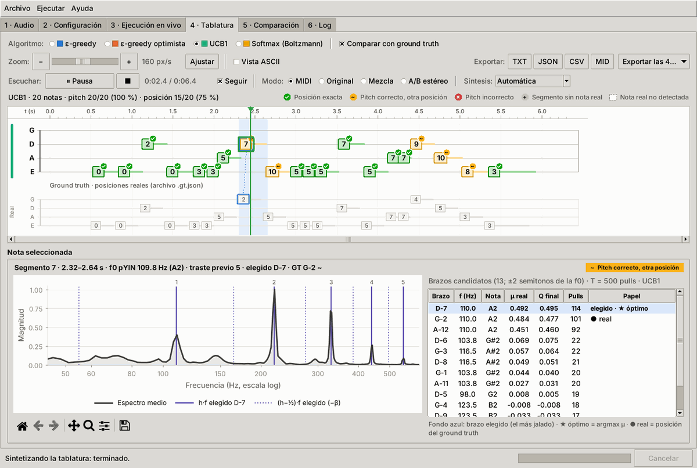

*Pestaña «4 · Tablatura» con `riff_saltos.mp3` (pieza sintética con ground truth). UCB1 acierta el pitch de las 20 notas y la posición de 15: verde ✓ = posición exacta, ámbar ~ = pitch correcto en otra cuerda. Debajo, la pauta con las posiciones reales. Abajo, el espectro de la nota seleccionada con el template armónico del brazo elegido y la tabla de brazos candidatos (μ real, Q final y pulls de cada uno).*

## Índice

1. [Instalación y ejecución](#1-instalación-y-ejecución)
2. [El problema como un bandit](#2-el-problema-como-un-bandit)
3. [El pipeline, etapa por etapa](#3-el-pipeline-etapa-por-etapa)
4. [Los cuatro algoritmos](#4-los-cuatro-algoritmos)
5. [La recompensa y por qué es así](#5-la-recompensa-y-por-qué-es-así)
6. [Guía de la interfaz gráfica](#6-guía-de-la-interfaz-gráfica)
7. [Evaluación](#7-evaluación)
8. [Limitaciones](#8-limitaciones)
9. [Extensión propuesta (no implementada): LinUCB contextual](#9-extensión-propuesta-no-implementada-linucb-contextual)
10. [Estructura del repositorio](#10-estructura-del-repositorio)
11. [Reproducibilidad](#11-reproducibilidad)
12. [Referencias](#12-referencias)

---

## 1. Instalación y ejecución

Requisitos: **Python 3.11 o superior** (probado con 3.12) con tkinter. No hace falta GPU.

### 1.1 Windows (PowerShell)

1. Instala Python desde [python.org](https://www.python.org/downloads/) y marca «Add python.exe to PATH». El instalador oficial ya incluye tkinter.
2. Abre PowerShell en la carpeta del proyecto:

```powershell
cd C:\ruta\a\smartuner
python -m venv .venv
.\.venv\Scripts\Activate.ps1
python -m pip install --upgrade pip
python -m pip install -r requirements.txt
python main.py
```

Si `Activate.ps1` falla con «la ejecución de scripts está deshabilitada en este sistema», permite los scripts locales para tu usuario y vuelve a activar el entorno:

```powershell
Set-ExecutionPolicy -Scope CurrentUser RemoteSigned
.\.venv\Scripts\Activate.ps1
```

También funciona sin activar el entorno: `.\.venv\Scripts\python.exe main.py`.

Si `python` abre la Microsoft Store en lugar de Python, usa el lanzador `py` que instala python.org (`py -m venv .venv`) o desactiva los alias `python.exe` y `python3.exe` en «Administrar alias de ejecución de aplicaciones» (búscalo en el menú Inicio). Una vez activado el entorno, `python` ya es el del entorno.

Lo que **no** hace falta instalar a mano:

- **ffmpeg.** `requirements.txt` incluye `imageio-ffmpeg`, que trae su propio binario de ffmpeg. Si ya tienes ffmpeg instalado (winget, Chocolatey, `C:\ffmpeg`), se usa ese. Si lo instalaste con `winget install Gyan.FFmpeg` *después* de abrir la terminal, Smartuner también lo encuentra: lee el PATH guardado en el registro y revisa las carpetas de WinGet y Chocolatey (`src/io_audio.py`, `find_ffmpeg`). Para indicar una ruta concreta: `$env:SMARTUNER_FFMPEG = "C:\ffmpeg\bin\ffmpeg.exe"`. Si no hay ningún ffmpeg, los MP3 se decodifican con `soundfile` (libsndfile ≥ 1.1).
- **Reproducción de audio.** `sounddevice` (en `requirements.txt`) reproduce el audio original y la tablatura sintetizada. En Windows y macOS la rueda de pip ya incluye PortAudio. Si no hay `sounddevice` o tarjeta de sonido, la pestaña Tablatura exporta un WAV (y la tablatura en `.mid`) a `cache/playback/` y lo abre con el reproductor del sistema, aunque sin cursor sincronizado; los botones ▶ de la pestaña Audio quedan deshabilitados y su tooltip explica por qué.

### 1.2 macOS y Linux

```bash
python3 -m venv .venv
source .venv/bin/activate
python -m pip install --upgrade pip
python -m pip install -r requirements.txt
python main.py
```

- **Linux** (Debian/Ubuntu): `sudo apt install python3-tk libportaudio2`. En Fedora: `python3-tkinter portaudio`. Sin `libportaudio2` la GUI funciona, pero no reproduce audio integrado.
- **macOS**: el Python de python.org trae tkinter; con Homebrew, `brew install python-tk`.

### 1.3 Componentes opcionales

| Componente | Para qué sirve | Cómo se instala | Si falta |
|---|---|---|---|
| **Demucs** (PyTorch para CPU) | Separar el bajo de una mezcla completa con la mejor calidad. | `python -m pip install -r requirements-optional.txt`. Ocupa ≈ 1–2 GB con PyTorch. La primera separación descarga ≈ 80 MB de pesos de `htdemucs` y después funciona sin Internet. Tarda minutos por canción en CPU, del orden de la duración de la pista. El resultado se guarda en `cache/`, así que reabrir la misma canción es instantáneo. | El método `auto` usa **HPSS**: librosa, sin PyTorch, tarda segundos y es aproximado. |
| **fluidsynth** + soundfont General MIDI | Síntesis realista del dataset y de la tablatura que se escucha. | Linux: `sudo apt install fluidsynth fluid-soundfont-gm` · macOS: `brew install fluid-synth` y un `.sf2` en `~/Library/Audio/Sounds/Banks/` · Windows: binario de FluidSynth (releases del proyecto en GitHub) en el PATH o en `SMARTUNER_FLUIDSYNTH`, y un soundfont (p. ej. `FluidR3_GM.sf2`) en `C:\soundfonts\`, en `%USERPROFILE%\soundfonts\`, en `data\` o en `SMARTUNER_SOUNDFONT`. | Sintetizador **Karplus-Strong** escrito en numpy (cuerda pulsada). |

### 1.4 Uso

**Interfaz gráfica** (la forma recomendada para la clase):

```powershell
python main.py                                   # abre la GUI
python main.py data/synthetic/linea_simple.mp3   # abre la GUI y analiza ese archivo
```

**Línea de comandos** (`--cli` + subcomando; `python main.py --cli --help` muestra todas las opciones):

```powershell
# 1. Dataset sintético con ground truth: MIDI → fluidsynth (o Karplus-Strong) → MP3 + .gt.json
python main.py --cli dataset --out data/synthetic --bpm 100 --method auto

# 2. Transcribir con UN algoritmo: imprime la tablatura ASCII, la exporta a TXT/JSON/CSV
#    y, si hay .gt.json junto al audio, imprime la precisión y la de los oráculos.
python main.py --cli analyze data/synthetic/linea_simple.mp3 --algo ucb1
python main.py --cli analyze mi_cancion.mp3 --algo softmax --separation-method hpss
python main.py --cli analyze mi_cancion.mp3 --separate --seed 7 --out results/mi_cancion

# 3. Experimento comparativo de los 4 algoritmos: tabla, CSV y gráficas (PNG + PDF)
python main.py --cli experiment data/synthetic/riff_saltos.mp3
python main.py --cli experiment data/synthetic/cromatica.mp3 --runs 30 --no-sweeps --budget 300
python main.py --cli experiment mi_cancion.mp3 --config mi_config.json --runs 10 --no-sweeps
```

- `--separation-method {auto,demucs,hpss}` implica `--separate`. `auto` usa Demucs si está instalado y, si no, HPSS. `demucs` falla con instrucciones de instalación si no lo encuentra.
- `experiment` no tiene `--separate`. Para experimentar con una mezcla, guarda desde la GUI una configuración JSON con «Separar bajo de mezcla» marcado, o escribe `"separate_bass": true` en la sección `audio`, y pásala con `--config`. Basta un JSON con solo esa clave, `{"audio": {"separate_bass": true}}`: lo que falta toma el valor por defecto.
- `experiment` acepta además `--budget T` (pulls por nota), `--no-sweeps` (omite los barridos de ε, Q₀, c y τ) y `--no-lambda` (omite el barrido de λ, que solo se hace si hay ground truth).
- `--quiet` muestra solo avisos y errores; `--verbose`, todo el detalle (DEBUG). Códigos de salida: 0 = correcto, 1 = error, 2 = argumentos inválidos, 130 = cancelado con Ctrl+C.
- Salidas: `analyze` escribe `<nombre>_<algoritmo>.txt`, `.json` y `.csv` en `results/<nombre>/`. `experiment` escribe en `results/<nombre>_<AAAAMMDD-HHMMSS>/`: `summary.csv`, `curves.csv`, `timing.csv`, `config.json` y cada gráfica en PNG y PDF (incluido el espectrograma). El MIDI de una tablatura se exporta desde la GUI (pestaña Tablatura → MID).

### 1.5 Pruebas

```powershell
python -m pytest -q
```

En Linux sin pantalla, las pruebas de la GUI necesitan un servidor X virtual:

```bash
xvfb-run -a -s "-screen 0 1400x900x24" python -m pytest -q -p no:warnings
```

`pytest.ini` ejecuta `tests/` y también los ejemplos `>>>` de los docstrings de `src/` (`--doctest-modules`): si un valor por defecto cambia y la documentación queda obsoleta, la prueba falla. Las pruebas que necesitan ffmpeg, fluidsynth o pantalla se omiten solas si falta el recurso. Son ≈ 800 pruebas (unitarias, doctests y de la GUI) y tardan ≈ 3 min en un contenedor Linux de 4 núcleos.

### 1.6 Usar tus propios MP3

**Bajo aislado o mezcla.** Smartuner está pensado para un **bajo aislado** (una pista de estudio, un stem o un bajo grabado solo). Con una mezcla completa, marca «Separar bajo de mezcla» en la pestaña Audio (o usa `--separate`):

- **Demucs** quita voz, batería, guitarras y teclados.
- **HPSS** quita batería, efectos percusivos y voces y platillos agudos, pero deja guitarras y teclados graves. Esos instrumentos pueden aparecer como notas falsas o como errores de pitch.

**Tiempos para una canción de ≈ 6 min.** Medidos con una pista de bajo aislado de 6:21 (993 notas detectadas) en un contenedor Linux de 4 núcleos:

| Paso | Tiempo |
|---|---|
| `analyze` en la CLI, sin separar | **≈ 50 s** en total: ≈ 44 s de análisis (≈ 33 s son de pYIN) y ≈ 5 s de transcripción con UCB1 |
| GUI: abrir el MP3 hasta ver la tablatura | ≈ 1 min 10 s (transcribe con los cuatro algoritmos y prepara el espectrograma) |
| Separación con HPSS | ≈ 10 s más |
| Separación con Demucs (CPU) | varios minutos la primera vez; instantáneo después (caché por SHA-1 del contenido) |
| `experiment --runs 10 --no-sweeps` | ≈ 3.5 min de pared: ≈ 44 s de análisis, ≈ 2.5 min de experimento (el programa estimó 2.4 min) y las gráficas |
| Experimento con la configuración por defecto (100 corridas + barridos) | ≈ 30 min (estimación que muestra el programa antes de empezar) |

El costo del experimento crece **linealmente con el número de notas**. Para una canción entera, baja «Corridas» a 10–30 y desmarca «Barridos de sensibilidad» en Configuración → Experimento, o usa `--runs 10 --no-sweeps` en la CLI. Con más de 50 notas, los barridos reducen solos sus corridas por valor; con 993 notas usan 5 en lugar de 30.

**Sin ground truth no hay precisión.** La precisión de pitch y de posición, el barrido de λ y el mapa de aciertos necesitan el `.gt.json` con las notas reales, que solo tiene el dataset sintético. Con tus MP3, las columnas de precisión muestran «—» y esas gráficas se omiten. Siguen siendo válidos la recompensa, el regret y el % de pulls óptimos, porque se miden respecto a μ, que no necesita ground truth. El resto es una **demostración cualitativa**:

- **De oído**: en los modos Mezcla y A/B estéreo, un pitch equivocado se oye como un batido o una disonancia.
- **A la vista**: en el espectro de cada nota se ve si el template armónico del brazo elegido cae sobre los picos.

Ninguna de las dos formas permite juzgar la cuerda: dos posiciones con el mismo pitch suenan igual. En la canción de prueba, pYIN dio f0 a 906 de los 993 segmentos; los otros 87 se resuelven con los 52 brazos.

---

## 2. El problema como un bandit

### 2.1 Brazos: posiciones del diapasón

Un bajo de 4 cuerdas en afinación estándar, con trastes 0–12 (`env.n_frets = 12`). Cada traste sube un semitono, es decir, multiplica la frecuencia por $2^{1/12}$:

$$
f(\text{cuerda}, \text{traste}) = f_{\text{cuerda}} \cdot 2^{\text{traste}/12}
$$

| Cuerda | Nota al aire | MIDI | $f$ al aire (Hz) | Traste 12 | $f$ en el traste 12 (Hz) |
|---|---|---|---|---|---|
| E (4.ª, la más grave) | E1 | 28 | 41.20 | E2 | 82.40 |
| A (3.ª) | A1 | 33 | 55.00 | A2 | 110.00 |
| D (2.ª) | D2 | 38 | 73.42 | D3 | 146.84 |
| G (1.ª, la más aguda) | G2 | 43 | 98.00 | G3 | 196.00 |

Son 4 × 13 = **52 brazos** y 28 notas distintas (MIDI 28–55). Hasta 3 posiciones producen el **mismo pitch**: por ejemplo, E2 (82.4 Hz) se toca en E-12, A-7 y D-2, y A1 (55 Hz) en A-0 y E-5. Por eso transcribir el pitch no basta para escribir una tablatura.

### 2.2 Poda con pYIN

pYIN estima una f0 aproximada $\hat f_0$ de cada nota. Solo se crean brazos a ±k semitonos de esa nota (`env.k_semitones = 2`):

$$
\mathcal{A}_s = \left\lbrace a : \left\lvert m(a) - \mathrm{round}\big(m(\hat f_0)\big) \right\rvert \le k \right\rbrace,
\qquad m(f) = 69 + 12\log_2\frac{f}{440}
$$

Con k = 2 quedan como mucho 5 pitches y, como no todos tienen 3 posiciones, como mucho 13 brazos. En `riff_saltos`, K va de 3 a 13 (185 brazos para 20 notas). La f0 solo **achica** el problema: la decisión la toma el agente. Si pYIN no da f0 (menos del 20 % de frames con voz, `pitch.min_voiced_ratio = 0.2`), se usan los 52 brazos.

### 2.3 Recompensa estocástica

Un segmento tiene $n_s$ frames de espectro: los centros a partir de `env.attack_skip_s = 0.03` s después del onset, cada 256 muestras ≈ 11.6 ms. En cada pull el entorno elige un frame $j$ **uniformemente al azar** y devuelve:

$$
r_t = S_j\!\left(f_{a_t}\right) \;-\; \lambda\,\frac{\lvert \text{traste}_{a_t} - \text{traste}_{\text{previo}} \rvert}{12} \;\;(+\;\text{ruido opcional})
$$

$S_j(f) \in [0, 1]$ es la **saliencia armónica** del frame $j$ en la frecuencia $f$ (sección 5). La recompensa es ruidosa porque los frames de una nota no son iguales: el decaimiento, la nota vecina que se cuela en la ventana o el vibrato cambian el espectro. En `riff_saltos`, la desviación estándar entre frames de la saliencia del mejor pitch es 0.074 de media (de 0.001 a 0.18 según la nota). `env.noise_std = 0` desactiva el ruido gaussiano extra.

### 2.4 Presupuesto, valor real y regret

**Presupuesto.** $T = 500$ pulls por nota (`env.budget`). Al agotarlo, el agente recomienda **el brazo más jalado**, con desempate por Q (`agent.recommend = "most_pulled"`).

**Valor real exacto.** Como el frame se elige uniformemente entre un número finito de frames, la esperanza de la recompensa se calcula sin simular:

$$
\mu_a = \mathbb{E}[r \mid a] = \frac{1}{n_s}\sum_{j=1}^{n_s} S_j(f_a) \;-\; \lambda\,\frac{\lvert \text{traste}_a - \text{traste}_{\text{previo}} \rvert}{12}
$$

El agente **nunca** ve $\mu$. El entorno la usa para medir el desempeño.

**Regret (pseudo-regret).** Es lo que cuesta, en valor esperado, no haber jugado el óptimo $\mu^{\star} = \max_a \mu_a$:

$$
R_T = \sum_{t=1}^{T}\left(\mu^{\star} - \mu_{a_t}\right) = \sum_{a} \Delta_a\, N_a(T), \qquad \Delta_a = \mu^{\star} - \mu_a
$$

No incluye el ruido del muestreo: mide solo el costo de las **decisiones**.

**Cadena de notas.** Las notas se resuelven en orden. El traste recomendado en la nota $s$ se vuelve el $\text{traste}_{\text{previo}}$ de la nota $s+1$. La primera nota usa `env.initial_hand_fret = 0`. Cada nota es un bandit **nuevo**: el agente se reinicia (`reset`), pero las notas quedan acopladas a través de la posición de la mano.

### 2.5 Diagrama: el bucle bandit de una nota

Cada nota detectada repite este bucle agente–entorno. Las notas quedan unidas solo por la posición de la mano:

```text
┌────────────────────────────────────────────────────────────────┐
│ ENTORNO de la nota s (BanditEnvironment)                       │
│ brazos: posiciones (cuerda, traste) a ±k semitonos de f0       │
│ S[j, a]: saliencia del frame j en la frecuencia de a           │
│ traste previo: el traste elegido en la nota s−1                │
│ μ_a = media_j S[j, a] − λ·|traste_a − traste_previo|/12        │
│       (valor real exacto: lo usa la evaluación, no el agente)  │
└────────────────────────────────────────────────────────────────┘
        ▲                                   │
        │ acción a_t                        │ recompensa r_t: frame j al azar,
        │ (cuerda, traste)                  │ r_t = S[j, a_t] − λ·|Δtraste|/12
        │                                   ▼
┌────────────────────────────────────────────────────────────────┐
│ AGENTE: ε-greedy · optimista · UCB1 · Softmax                  │
│ select_arm():     a_t según Q, N y su regla de exploración     │
│ update(a_t, r_t): N(a_t) += 1;  Q(a_t) += α·(r_t − Q(a_t))     │
└────────────────────────────────────────────────────────────────┘
        │ tras T = 500 pulls → recommend(): el brazo más jalado
        ▼
  posición de la nota s en la tablatura ──► traste previo de la nota s+1
```

El agente solo ve los pares $(a_t, r_t)$. La matriz $S$ y los valores $\mu_a$ los conoce el entorno, que los usa para medir el regret y el % de pulls óptimos. La sección 3 muestra de dónde salen los segmentos, la f0 y el espectro; la sección 4, cómo elige cada agente.

### 2.6 Diccionario RL ↔ Smartuner

| Concepto (Sutton & Barto, cap. 2) | En Smartuner |
|---|---|
| Problema de K brazos | una nota detectada (segmento) |
| Acción $a$ | una posición (cuerda, traste) candidata |
| Recompensa $R_t$ | saliencia de un frame al azar menos la penalización de tocabilidad |
| Valor de acción $q_{\star}(a)$ | $\mu_a$, exacto y oculto al agente |
| Estimación $Q_t(a)$ | media (o promedio exponencial) de las recompensas del brazo |
| Horizonte | $T = 500$ pulls por nota |
| Política final | brazo más jalado |
| Regret | $\sum_t (\mu^{\star} - \mu_{a_t})$ |

---

## 3. El pipeline, etapa por etapa

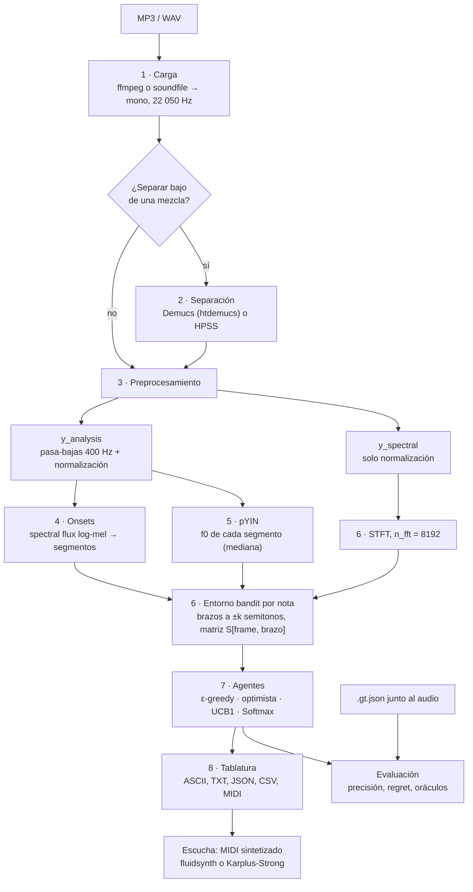
```mermaid
flowchart TD
    A["MP3 / WAV"] --> B["1 · Carga<br/>ffmpeg o soundfile → mono, 22 050 Hz"]
    B --> C{"¿Separar bajo<br/>de una mezcla?"}
    C -- "no" --> D["3 · Preprocesamiento"]
    C -- "sí" --> S["2 · Separación<br/>Demucs (htdemucs) o HPSS"]
    S --> D
    D --> E["y_analysis<br/>pasa-bajas 400 Hz + normalización"]
    D --> F["y_spectral<br/>solo normalización"]
    E --> G["4 · Onsets<br/>spectral flux log-mel → segmentos"]
    E --> H["5 · pYIN<br/>f0 de cada segmento (mediana)"]
    F --> I["6 · STFT, n_fft = 8192"]
    G --> J["6 · Entorno bandit por nota<br/>brazos a ±k semitonos, matriz S[frame, brazo]"]
    H --> J
    I --> J
    J --> K["7 · Agentes<br/>ε-greedy · optimista · UCB1 · Softmax"]
    K --> L["8 · Tablatura<br/>ASCII, TXT, JSON, CSV, MIDI"]
    L --> M["Escucha: MIDI sintetizado<br/>fluidsynth o Karplus-Strong"]
    GT[".gt.json junto al audio"] --> N["Evaluación<br/>precisión, regret, oráculos"]
    K --> N
```

Todo el análisis pasa por `src/pipeline.py::analyze`, que devuelve un `AnalysisResult`; la GUI y la CLI usan la misma función. Onsets, pYIN y espectro comparten el salto de **256 muestras (11.6 ms)**, así que un frame de cada uno corresponde al mismo instante.

**1 · Carga** (`src/io_audio.py`). ffmpeg decodifica cualquier formato a float32 mono a **22 050 Hz** en un solo paso (`-f f32le -ac 1 -ar 22050`). Al pasar a mono se promedian los canales en lugar de sumarlos (`-rematrix_maxval 1.0`). La frecuencia de muestreo es fija porque todas las ventanas en muestras están calibradas para ella; `Config.validate` rechaza otra.

**2 · Separación, opcional** (`src/separation.py`, `src/demucs_runner.py`). Solo actúa si `audio.separate_bass` está activo. El método por defecto es `audio.separation_method = "auto"`.

- **Demucs** corre en un **subproceso** que llama a la API de Demucs (`get_model` + `apply_model`, modelo `htdemucs`). Por eso se puede cancelar, la GUI no se congela y no hacen falta ffmpeg en el PATH ni torchaudio. El stem de bajo se guarda en `cache/`.
- **HPSS** (Fitzgerald, 2010) filtra el espectrograma con medianas: una temporal, que retiene lo armónico, y otra en frecuencia, que retiene lo percusivo. Se queda con la parte armónica y aplica un pasa-bajas de 1.2 kHz. Trabaja en memoria y tarda segundos.

**3 · Preprocesamiento: dos señales** (`src/preprocessing.py`).

- `y_analysis` pasa por un pasa-bajas Butterworth de orden 4 a **400 Hz** (`preprocess.lowpass_hz`, `filter_order`) y se normaliza a pico 0.99. La usan los onsets y pYIN.
- `y_spectral` solo se normaliza. La usa la recompensa.

¿Por qué dos? pYIN y los onsets funcionan mejor si domina la fundamental: los armónicos agudos y el ruido de trastes provocan errores de octava y onsets falsos, y la nota más aguda posible (G-12) está en 196 Hz. La recompensa, en cambio, **necesita** los armónicos: con N = 5 armónicos llega a 5 × 196 = 980 Hz, y sin ellos no distinguiría una nota de su octava. El filtro es de **fase cero** (`sosfiltfilt`: se aplica hacia adelante y hacia atrás), así que no desplaza los onsets respecto a la señal sin filtrar.

**4 · Segmentación por onsets** (`src/segmentation.py`). La función de novedad es el *spectral flux* sobre un log-mel adaptado al bajo: 40 bandas hasta 1 kHz y piso de −40 dB. Solo cuentan los **aumentos** de nivel, que es lo que produce una cuerda al pulsarse:

$$
SF(t) = \frac{1}{B}\sum_{b=1}^{B} \max\big(0,\; L(t,b) - L(t-1,b)\big)
$$

- Los picos de $SF$ son los onsets: umbral δ = 0.05 (`segmentation.onset_delta`), separación mínima de 0.07 s (`onset_wait_s`) y *backtrack* al mínimo de energía previo.
- El segmento $i$ va del onset $i$ al $i+1$, con el final recortado donde el RMS cae bajo −35 dB (`rms_threshold_db`).
- Se descartan los segmentos de menos de 0.06 s (`min_duration_s`) y los silenciosos.

**5 · Pitch con pYIN** (`src/pitch.py`). YIN busca el periodo $\tau$ que minimiza la diferencia $d(\tau) = \sum_j (x_j - x_{j+\tau})^2$, normalizada por su media acumulada. pYIN (Mauch y Dixon, 2014) recorre muchos umbrales y elige la trayectoria más probable con un HMM.

- Se ejecuta una vez sobre toda la pista (por bloques de 15 s en pistas largas) entre 35 y 250 Hz, con ventana de 2048 muestras ≈ 93 ms, más de dos periodos de E1.
- Valores de la configuración: `max_transition_rate = 150` oct/s y `switch_prob = 0.1`, frente a 35.92 y 0.01 de librosa. Con los de librosa, el HMM «arrastraba» la nota anterior por la suboctava: 3 errores de octava en 299 notas de prueba frente a 0.
- La f0 del segmento es la **mediana** de los frames con voz tras saltar 30 ms de ataque. La mediana es robusta a frames sueltos con error de octava.

**6 · Espectro y entorno** (`src/environment.py`). STFT de `y_spectral` con `n_fft = 8192`: una ventana de 0.37 s y 2.69 Hz por bin. Solo se guardan los bins hasta ≈ 1.2 kHz, que es lo único que lee la recompensa. Para cada segmento se precalcula una vez la matriz `salience[frame, brazo]`, así que cada pull es una lectura O(1) más la penalización, que depende del traste previo.

**7 · Agentes** (`src/agents.py`, `src/experiments.py`). Un agente recorre las notas en orden (`run_chain`): reinicio → T × (`select_arm`, `pull`, `update`) → `recommend` → el traste elegido pasa a ser el traste previo de la nota siguiente.

**8 · Tablatura** (`src/tab.py`). Une cada segmento con su posición y la dibuja en ASCII con 4 líneas (G arriba, E abajo) y marcas de tiempo. Exporta a TXT, JSON, CSV y MIDI.

**9 · Escuchar la tablatura** (`src/tab.py`, `gui/playback.py`).

- `notes_to_midi` crea un MIDI con los tiempos **absolutos** de cada segmento y el programa General MIDI 33 en numeración 0–127 («Electric Bass (finger)»).
- `render_notes` lo sintetiza con fluidsynth + soundfont o, si no hay, con **Karplus-Strong** (Karplus y Strong, 1983): una línea de retardo de $N \approx f_s/f_0$ muestras, llena de ruido, que se realimenta con un promedio de dos muestras, $y[n] = \rho\cdot\tfrac{1}{2}\,(y[n-N] + y[n-N-1])$. El promedio es un pasa-bajas, así que los agudos se apagan antes que la fundamental, como en una cuerda real.
- `playback_mix` combina la síntesis con el original en cuatro modos: MIDI, original, mezcla y estéreo A/B (ver la pestaña Tablatura en la sección 6).

---

## 4. Los cuatro algoritmos

Todos comparten el bucle de Sutton y Barto (§2.4) y la misma regla de aprendizaje. Solo difieren en **cómo eligen** el brazo.

```text
para cada nota s, en orden:
    entorno ← BanditEnvironment(datos_s, traste_previo, λ)
    agente.reset()                       # Q ← Q₀, N ← 0, t ← 0
    repetir T veces:
        a ← agente.select_arm()          # ← lo único que cambia entre algoritmos
        r ← entorno.pull(a)              # frame j al azar: S_j(f_a) − λ·|Δtraste|/12
        agente.update(a, r)              # N(a) += 1;  Q(a) += α·(r − Q(a))
    brazo_s ← agente.recommend()         # el más jalado (desempate por Q)
    traste_previo ← traste(brazo_s)
```

### 4.1 Regla incremental: α = 1/n frente a α constante

La media de las $n$ recompensas de un brazo se actualiza sin guardar el historial:

$$
Q_{n+1} = \frac{1}{n}\sum_{i=1}^{n} R_i = Q_n + \frac{1}{n}\left(R_n - Q_n\right)
\qquad\Longrightarrow\qquad
Q_{n+1} = Q_n + \alpha_n\left(R_n - Q_n\right)
$$

$R_n - Q_n$ es el **error de predicción**: si la recompensa supera lo esperado, Q sube; si no, baja.

- **α = 1/n** (ε-greedy, UCB1, Softmax): da la media muestral exacta, que converge a $\mu_a$ (Robbins–Monro: $\sum\alpha = \infty$, $\sum\alpha^2 < \infty$). El primer pull usa paso 1, así que $Q \leftarrow R_1$ y el valor inicial $Q_0$ se olvida de inmediato.
- **α constante** (optimista): da un promedio exponencial que pesa más lo reciente. El valor inicial se olvida como $(1-\alpha)^n$:

$$
Q_{n+1} = (1-\alpha)^n Q_1 + \sum_{i=1}^{n}\alpha(1-\alpha)^{n-i}R_i
$$

### 4.2 ε-greedy

$$
A_t =
\begin{cases}
\arg\max_a Q_t(a) & \text{con probabilidad } 1-\varepsilon \quad\text{(explotar; empates al azar)}\\[2pt]
\text{un brazo uniforme al azar} & \text{con probabilidad } \varepsilon \quad\text{(explorar)}
\end{cases}
$$

Valores por defecto: ε = 0.1, sin decaimiento (`agent.epsilon_decay = 1.0`).

- Con ε > 0, todos los brazos se siguen probando, así que las Q convergen a μ.
- El precio es una tasa de acierto asintótica de $1-\varepsilon+\varepsilon/K$ y un **regret lineal**: una fracción ε de los pulls siempre es al azar.
- La exploración es **ciega**: un brazo pésimo se prueba tanto como uno casi óptimo.
- Con decaimiento, $\varepsilon_t = \max(\varepsilon_{\min}, \varepsilon_0 d^{\,t})$ (`epsilon_min = 0.01`): explora mucho al principio, cuando las estimaciones son pobres, y poco al final. Es la versión práctica de GLIE (*greedy in the limit with infinite exploration*).

```text
u ~ U[0,1);  si u < ε: a ← uniforme(0..K−1)  si no: a ← argmax Q (empates al azar)
```

### 4.3 ε-greedy optimista

Es el mismo agente con $Q_0 = 2$, mayor que la recompensa máxima posible (1), con $\alpha = 0.1$ constante y $\varepsilon = 0$ (`agent.q0`, `optimistic_alpha`, `optimistic_epsilon`).

- Cada brazo que se prueba «decepciona» ($r < Q_0$) y su Q baja por debajo de las de los brazos no probados. El agente, aunque sea greedy, recorre todos los brazos sin tirar ninguna moneda. Es exploración **dirigida y temporal**.
- **¿Por qué α constante?** Con α = 1/n, el primer pull haría $Q \leftarrow r$ y el optimismo desaparecería tras **un** pull por brazo, dejando un greedy con estimaciones de una sola muestra. Con α = 0.1, el peso de $Q_0$ decae como $0.9^n$: 0.35 tras 10 pulls y 0.04 tras 30. Cada brazo se prueba varias veces antes de descartarlo.
- Limitación: si el problema cambiara con el tiempo, el optimismo inicial no ayudaría.

### 4.4 UCB1: optimismo ante la incertidumbre

$$
A_t = \arg\max_a \left[\, Q_t(a) + c\,\sqrt{\frac{\ln t}{N_t(a)}} \,\right]
\qquad (\text{primero, cada brazo una vez: } N_t(a) = 0 \Rightarrow \text{índice} = +\infty)
$$

El índice es una **cota superior de confianza** de $\mu_a$. Por la desigualdad de Hoeffding, para recompensas en [0, 1]:

$$
P\!\left(\mu_a > Q_t(a) + \sqrt{\tfrac{2\ln t}{N_t(a)}}\right) \le t^{-4}
$$

De ahí sale $c = \sqrt{2} \approx 1.414$, el UCB1 original (`agent.ucb_c = 1.414`).

- El bono decrece como $1/\sqrt{N}$ cuando se prueba el brazo y crece despacio, como $\sqrt{\ln t}$, mientras no se prueba.
- Un brazo se elige por tener Q alto (explotar) o bono alto (explorar), unidos en un solo número.
- Garantía (Auer et al., 2002): $\mathbb{E}[R_T] \le \sum_{a:\Delta_a>0} \frac{8\ln T}{\Delta_a} + \left(1+\frac{\pi^2}{3}\right)\sum_a \Delta_a$. Es regret logarítmico, del orden óptimo de Lai y Robbins.

Esa garantía es **asintótica** y depende de $1/\Delta_a$. Un brazo subóptimo deja de elegirse cuando su bono cae por debajo de su brecha, es decir, cuando $N_a \gtrsim c^2\ln t/\Delta_a^2$. Dos casos con números reales de la sección 5.4, en t = 500:

- **Brazo de otro pitch**, $\Delta \approx 0.42$ (D-1 frente a D-2): hacen falta ≈ 70 pulls de ese brazo.
- **Misma nota en otra cuerda**, $\Delta = 0.1 \cdot 5/12 \approx 0.042$ (A-7 frente a D-2): hacen falta ≈ **7 000** pulls, 14 veces el presupuesto.

Con T = 500, UCB1 con c = √2 **no puede** separar las posiciones del mismo pitch y explora durante todo el presupuesto (sección 7).

### 4.5 Softmax (Boltzmann)

$$
\pi_t(a) = \frac{e^{Q_t(a)/\tau}}{\sum_b e^{Q_t(b)/\tau}},
\qquad
\frac{\pi_t(a)}{\pi_t(b)} = e^{\left(Q_t(a)-Q_t(b)\right)/\tau}
$$

Valores por defecto: τ = 0.1, sin annealing, $Q_0 = 0$, α = 1/n.

- La exploración está **graduada por el valor**: un brazo casi tan bueno como el mejor se prueba a menudo, y uno pésimo casi nunca.
- **τ** tiene las unidades de la recompensa. Con τ → ∞ la elección es uniforme; con τ → 0 es greedy. Con τ = 0.1, una ventaja de 0.42 (otro pitch) multiplica la probabilidad por $e^{4.2} \approx 67$, pero una de 0.042 (misma nota en otra cuerda) solo por $e^{0.42} \approx 1.5$.
- **Annealing**: $\tau_t = \max(\tau_{\min}, \tau_0 d^{\,t})$ (`tau_decay = 1.0`, `tau_min = 0.01`) explora al principio y se «enfría» hacia greedy, como el recocido simulado.
- **Estabilidad numérica**: $\pi$ no cambia si se resta la misma constante a todas las Q. Se resta $\max_b Q(b)$ antes de exponenciar: el mayor exponente es 0, nunca hay overflow (con $Q = 10^4$ y τ = 0.1, $e^{10^5}$ = inf) y el denominador es ≥ 1.
- El brazo se muestrea por transformada inversa: con $u \sim U[0,1)$ se elige el primer brazo cuya probabilidad acumulada supera $u$.

**Riesgo: fijarse en un brazo.** Los brazos sin probar valen $Q = 0$. En cuanto un brazo da $r \approx 0.6$, pesa $e^{6} \approx 400$ frente a 1 de cada brazo sin probar. Con 13 brazos, la probabilidad de probar otro baja a ≈ 3 % por pull. Con τ = 0.01 el efecto es extremo (sección 7.4.6).

### 4.6 Lo que ve cada uno en la GUI

`decision_scores()` devuelve el criterio con el que decide cada agente, y la pestaña «Ejecución en vivo» lo dibuja en su panel (d):

| Algoritmo | Criterio del panel (d) |
|---|---|
| ε-greedy y optimista | Q |
| UCB1 | índice Q + c·√(ln t / n) |
| Softmax | probabilidades π |

Además, cada `select_arm()` deja una explicación en español (`Decision.text`), por ejemplo: «UCB1: brazo 4 con índice 0.99 = Q 0.06 + bono 0.92 (gana por el bono de incertidumbre → explora)».

---

## 5. La recompensa y por qué es así

### 5.1 Saliencia armónica con penalización inter-armónica

Una cuerda pulsada vibra en $f$ y en sus múltiplos $2f, 3f, \dots$, así que la huella de una nota en el espectro es un **peine** de picos. La saliencia mide cuánto encaja el espectro del frame $j$ con el peine del candidato (suma armónica, Klapuri 2006) y resta la energía que cae **entre** los dientes del peine:

$$
\tilde X_j = \frac{\lvert X_j \rvert}{\max \lvert X_j \rvert},
\qquad
w_h = \frac{1/h}{\sum_{k=1}^{N} 1/k}
$$

$$
S^{+}_j(f) = \sum_{h=1}^{N} w_h\, \tilde X_j(h f),
\qquad
S^{-}_j(f) = \sum_{h=1}^{N} w_h\, \tilde X_j\!\left((h-\tfrac{1}{2}) f\right),
\qquad
S_j(f) = \max\!\left(S^{+}_j(f) - \beta\, S^{-}_j(f),\; 0\right)
$$

Valores por defecto: N = 5 armónicos y β = 0.5 (`env.n_harmonics`, `env.beta`). Las decisiones de diseño:

- **Normalización por frame.** La saliencia no depende del volumen: una nota suave y una fuerte con el mismo timbre dan lo mismo. Como los pesos suman 1 y $0 \le \tilde X \le 1$, se cumple $S \in [0, 1]$.
- **Pesos $1/h$.** En el bajo, los armónicos graves son los más fuertes y fiables, y estos pesos favorecen al candidato más grave que explica el peine.
- **Tolerancia de afinación** (`env.tolerance_semitones = 0.33`). $\tilde X(x)$ se lee como el **máximo** de la magnitud interpolada en $[x\cdot 2^{-0.33/12},\; x\cdot 2^{+0.33/12}]$. Eso absorbe la desafinación y la inarmonicidad (los armónicos de una cuerda gruesa salen algo agudos). La interpolación es lineal en $\log_2 f$, así que su máximo está en un extremo o en un bin interior: el código calcula el máximo **exacto**, no una rejilla de puntos.
- **Una saliencia por pitch.** La saliencia se calcula una vez por nota MIDI, con la frecuencia temperada $440\cdot 2^{(m-69)/12}$, y se copia a todas sus posiciones. A-0 y E-5 tienen columnas **idénticas**: el espectro no sabe en qué cuerda se tocó la nota.

### 5.2 STFT frente a CQT (comparación medida)

Comparación medida durante el desarrollo (docstring de `EnvConfig` en `src/config.py`) sobre el dataset en dos versiones (fluidsynth y Karplus-Strong, 114 notas) y 8 piezas de validación que no forman parte de él (230 notas):

- **Oráculo**: precisión de pitch de argmax μ en cada nota, con la poda k = 2.
- **Sin poda**: lo mismo con los 52 brazos; mide el poder discriminativo de la saliencia sola.
- **Margen**: μ del mejor brazo con el pitch correcto menos μ del mejor brazo con otro pitch, medio y mínimo sobre las notas. Negativo significa que el oráculo se equivoca.
- **Bandits**: precisión de pitch media de los cuatro algoritmos (10 corridas, T = 500).

| Espectro | Oráculo, dataset / validación | Sin poda (dataset) | Margen medio | Margen mínimo | Bandits, dataset / validación |
|---|---|---|---|---|---|
| CQT, 36 bins/oct | 99.2 / 92.0 % | 96.7 % | 0.40 | −0.02 | 98.6 / 91.4 % |
| CQT, 24 bins/oct | 100 / 93.1 % | 99.2 % | 0.29 | 0.00 | 98.8 / 92.1 % |
| STFT, n_fft = 4096 | 100 / 96.2 % | 100 % | 0.20 | +0.003 | 97.3 / 94.1 % |
| **STFT, n_fft = 8192 (por defecto)** | **100 / 94.6 %** | **100 %** | **0.33** | **+0.05** | **99.4 / 94.2 %** |

La CQT tiene resolución logarítmica, como las notas, pero con 36 bins por octava su ventana en E1 dura ≈ 1.2 s. En notas rápidas, la nota siguiente «contamina» la saliencia: E-0 seguido de E-1 llevaba al oráculo a elegir E-1. La STFT de 4096 muestras resuelve mejor el tiempo, pero su margen es menor y el mínimo queda casi en cero (+0.003). La STFT de 8192 muestras (0.37 s) es el mejor compromiso entre resolución en frecuencia y en tiempo: margen positivo en **todas** las notas del dataset con holgura (+0.05) y la mejor precisión de los bandits. La CQT sigue disponible (`env.spectrum = "cqt"`) y es la que dibuja el espectrograma de la GUI.

### 5.3 El término β contra los errores de octava (ejemplo numérico)

El candidato una octava arriba, $2f_0$, tiene armónicos $\lbrace 2f_0, 4f_0, \dots\rbrace$, que son todos armónicos **reales** de la nota. La suma pura ($\beta = 0$) no puede descartarlo. Pero sus huecos $(h-\tfrac12)\,2f_0 = \lbrace f_0, 3f_0, 5f_0, \dots\rbrace$ caen justo sobre los armónicos **impares** reales, así que $S^-$ es grande y $\beta S^-$ lo hunde. Para el candidato correcto, los huecos están entre picos y $S^- \approx 0$. El error contrario, una octava abajo, ya lo castiga $S^+$: la mitad de su peine cae en zonas vacías.

Datos reales: segmento 7 de `riff_saltos` (A2, 110 Hz; medias sobre sus 24 frames):

| Candidato | $S^+$ | $S^-$ | $S$ con β = 0 | $S$ con β = 0.5 |
|---|---|---|---|---|
| 55 Hz (octava abajo) | 0.218 | 0.053 | 0.218 | 0.192 |
| **110 Hz (correcto)** | **0.524** | **0.030** | **0.524** | **0.509** |
| 220 Hz (octava arriba) | 0.509 | 0.341 | 0.509 | 0.338 |

Sin β, la octava arriba queda a solo **0.015** del pitch correcto, menos que el ruido entre frames. Con β = 0.5 la ventaja sube a **0.171**, 11 veces más.

### 5.4 Penalización de tocabilidad: lo único que separa posiciones del mismo pitch

$$
\text{pen}(a) = \lambda\,\frac{\lvert \text{traste}_a - \text{traste}_{\text{previo}} \rvert}{12}, \qquad \lambda = 0.1 \;(\texttt{env.lam})
$$

Dividir por 12 expresa el salto en «octavas de mástil», en la misma escala que la saliencia: mover la mano 12 trastes cuesta λ. Como las posiciones gemelas tienen la misma saliencia, **solo esta penalización las distingue**.

Ejemplo real, segmento 2 de `riff_saltos` (E2, 82.4 Hz, traste previo 0): saliencia media 0.591 en las tres posiciones, y

| Posición | μ |
|---|---|
| D-2 | 0.574 |
| A-7 | 0.533 |
| E-12 | 0.491 |

Las brechas son exactamente $0.1\cdot 5/12 = 0.042$ y $0.1\cdot 10/12 = 0.083$. Un brazo de otro pitch (D-1, μ = 0.151) está a 0.42.

Las brechas entre posiciones del mismo pitch son de **≈ λ/12 ≈ 0.008 por traste**, del orden del ruido entre frames. Distinguirlas es la parte difícil del problema bandit. Con λ = 0 esas posiciones quedan exactamente empatadas.

Opciones relacionadas:

- `env.open_string_free` (desactivado por defecto): tocar una cuerda al aire no cuesta movimiento ni mueve la mano.
- Con λ ≥ 0.5 la penalización empieza a imponerse a la saliencia y el oráculo pierde pitch: 99.2 % con λ = 0.5, 97 % con 1.0 y 89 % con 2.0, medido en el desarrollo.

### 5.5 μ exacto y números aleatorios comunes

- **μ exacto** (sección 2.4): permite medir el regret y el % de pulls óptimos sin estimarlos, y definir el **oráculo** (argmax μ).
- **Números aleatorios comunes.** En la corrida $r$, el entorno de la nota $s$ usa `default_rng([seed, r, s])` para **todos** los algoritmos, y el agente usa `default_rng([seed, r, s, 1 + índice_algoritmo])`. Cada pull consume exactamente una llamada al generador del entorno, la que elige el frame. Así, el pull $t$ de cualquier algoritmo ve el **mismo frame**, y las diferencias entre algoritmos se deben a sus decisiones y no a la suerte del muestreo. Es una técnica clásica de reducción de varianza en simulación.

---

## 6. Guía de la interfaz gráfica

`python main.py` abre una ventana con seis pestañas. Todas comparten el estado: seleccionar una nota o un algoritmo en una pestaña lo selecciona en las demás. Las tareas largas (análisis, Demucs, experimento, dataset) corren en un hilo, con barra de progreso y botón **Cancelar** en la barra de estado.

Menús:

- **Archivo**: Abrir audio (Ctrl+O), Generar dataset sintético, Guardar y Cargar configuración, Salir.
- **Ejecutar**: Re-transcribir con la configuración actual, Ejecutar experimento completo.
- **Ayuda**: Acerca de.

### 6.1 Pestaña 1 · Audio: qué «escucha» el sistema

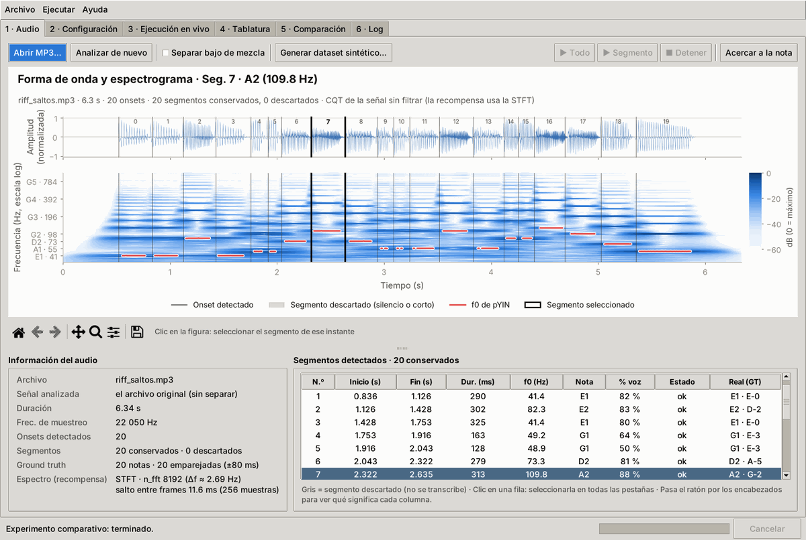

- **Abrir MP3…**: elige un archivo, lo analiza (etapas 1–6) y lo transcribe con los cuatro algoritmos.
- **Analizar de nuevo**: repite el análisis del mismo archivo con la configuración actual.
- **Separar bajo de mezcla**: activa la etapa 2 con el método elegido en Configuración (automático, Demucs o HPSS).
- **Generar dataset sintético…**: crea las tres piezas con sus `.mid` y `.gt.json`.
- **▶ Todo / ▶ Segmento / ■ Detener**: reproducen el audio analizado completo o solo la nota seleccionada. Necesitan `sounddevice` y una salida de audio; si faltan, quedan deshabilitados (como en la captura, tomada en un contenedor sin tarjeta de sonido) y su tooltip explica por qué.
- **Acercar a la nota**: hace zoom sobre la nota seleccionada.
- **Figura**: forma de onda arriba; abajo, espectrograma (CQT, solo para visualizar) con los onsets (líneas), la f0 de pYIN (rojo) y los segmentos descartados (gris). Un clic selecciona la nota de ese instante. La barra de matplotlib permite zoom, desplazamiento y guardar la imagen.
- **Información del audio**: archivo, señal analizada (original o separada), duración, frecuencia de muestreo, onsets, segmentos conservados y descartados, notas del ground truth emparejadas (±80 ms) y espectro de la recompensa.
- **Tabla de segmentos**: número, inicio, fin, duración, f0, nota, % de frames con voz, estado (ok, silencio o corto) y posición real si hay ground truth.

### 6.2 Pestaña 2 · Configuración: todos los hiperparámetros

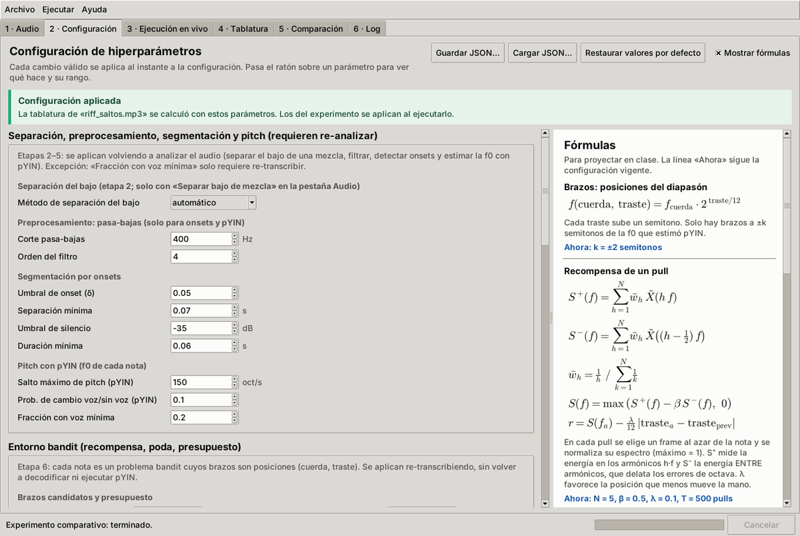

- **Secciones**: análisis (separación, pasa-bajas, onsets y pYIN), entorno bandit (k, T, N, β, tolerancia, λ, espectro), una tarjeta por algoritmo y experimento. Cada control muestra unidad y rango, y su tooltip explica qué hace. Etiquetas, rangos y textos salen de `PARAM_SPECS` en `src/config.py`, así que GUI, CLI y documentación no divergen.
- **Aviso de estado**: cada cambio válido se aplica al instante y el aviso dice qué hace falta para verlo reflejado.

  | Cambio | Qué hace falta |
  |---|---|
  | Análisis | Analizar de nuevo (excepción: «Fracción con voz mínima» solo requiere re-transcribir) |
  | Entorno o agentes | Aplicar y re-transcribir (sin repetir pYIN) |
  | Experimento | Se aplica al ejecutarlo |

- **Tarjetas de algoritmo**: regla de decisión, hiperparámetros y la casilla **Incluir en el experimento**.
- **Guardar JSON… / Cargar JSON… / Restaurar valores por defecto**: el JSON es el mismo que acepta `--config` en la CLI.
- **Mostrar fórmulas**: panel para proyectar en clase, con las fórmulas de la recompensa y de cada agente y una línea «Ahora» con los valores vigentes.

### 6.3 Pestaña 3 · Ejecución en vivo: cómo «piensa» un agente, pull a pull

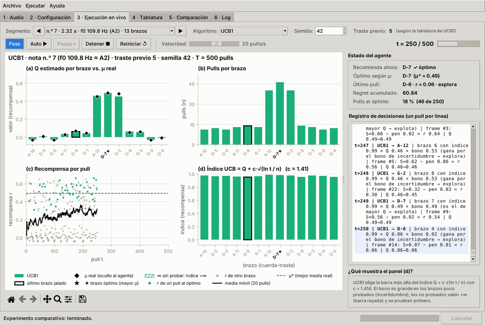

Es la pestaña central para explicar el aprendizaje por refuerzo. Toma **una** nota y **un** algoritmo y ejecuta el bucle bandit paso a paso.

- **Controles de la sesión**: Segmento (◀ ▶ y lista), Algoritmo, Semilla y Traste previo (el que dejó la tablatura de ese algoritmo).
- **Paso / Auto ▶ / Pausa / Detener / Reiniciar**, la **Velocidad** en pulls por segundo y el progreso t/T.
- **(a) Q estimado vs. μ real**: barras con la Q de cada brazo y rombos con la μ, que el agente no ve. El ★ marca el brazo óptimo y el recuadro, el último brazo jalado.
- **(b) Pulls por brazo**: dónde gasta el presupuesto.
- **(c) Recompensa por pull**: puntos (los del brazo óptimo en color), media móvil de 20 pulls y línea de μ\* (la mejor media real).
- **(d) Criterio de decisión**: Q, índice UCB o probabilidades π según el algoritmo; el recuadro «¿Qué muestra el panel (d)?» lo explica.
- **Estado del agente**: brazo recomendado ahora, óptimo según μ, último pull, regret acumulado y % de pulls al óptimo.
- **Registro de decisiones**: una línea por pull con la explicación. Por ejemplo: «t=250 | UCB1 → D-6 | brazo 4 con índice 0.99 = Q 0.06 + bono 0.92 (gana por el bono de incertidumbre → explora) | frame #14: S=0.07 − pen 0.01 = r 0.06 | Q 0.06→0.06».

Con la semilla de la configuración y el traste previo de la tablatura, la sesión reproduce **exactamente**, pull a pull, la corrida que produjo la tablatura de la pestaña 4.

### 6.4 Pestaña 4 · Tablatura: el resultado, nota a nota, y su escucha


**Visualización**

- **Algoritmo**: cuál de las cuatro tablaturas se muestra (una corrida con la semilla de la configuración).
- **Comparar con ground truth**: marca cada nota con su resultado y dibuja debajo la pauta con las posiciones reales.

  | Marca | Significado |
  |---|---|
  | ✓ | posición exacta |
  | ~ | pitch correcto en otra posición |
  | ✗ | pitch incorrecto |
  | + | segmento sin nota real |
  | borde discontinuo | nota real no detectada |

- **Zoom − / +, Ajustar**: escala horizontal en píxeles por segundo. **Vista ASCII** muestra el mismo texto que exporta la CLI.
- **Exportar**: TXT, JSON, CSV o MID, o «Exportar las 4…».
- **Nota seleccionada**: el espectro medio de la nota con el template del brazo elegido (líneas sólidas en $h\cdot f$, punteadas en $(h-\tfrac12)\cdot f$) y la tabla de brazos candidatos con f, nota, **μ real**, **Q final**, pulls y papel (elegido, ★ óptimo, ● real).

**Escuchar la tablatura**

La fila **Escuchar** sintetiza la tablatura del algoritmo mostrado. La primera vez tarda (en segundo plano); después usa caché.

- **▶ Reproducir / ⏸ Pausa / ■**, el reloj y **Seguir**: con Seguir activo, la vista avanza por páginas. Un cursor verde recorre la tablatura y la nota que suena se rodea en verde. Un clic en la regla de tiempo reproduce desde ese instante; la barra espaciadora alterna ▶/⏸.
- **Modo**:
  - **MIDI**: solo la síntesis.
  - **Original**: solo el audio analizado.
  - **Mezcla**: ambos sumados, con la sonoridad igualada por RMS. Un pitch equivocado choca con el real y produce un batido de $\lvert f_1 - f_2\rvert$ pulsos por segundo.
  - **A/B estéreo**: el original a la **izquierda** y la síntesis a la **derecha**. Con auriculares se comparan sin que una tape a la otra.
- Cambiar de modo o de algoritmo mientras suena continúa desde el mismo instante: así se comparan de oído.
- **Síntesis**: Automática (fluidsynth si existe), FluidSynth o Karplus-Strong.
- Solo suena un reproductor a la vez: si la pestaña Audio empieza a reproducir, esta se pausa.
- Recuerda que de oído se juzgan el **pitch** y el **ritmo**, no la cuerda: A-0 y E-5 suenan igual.

### 6.5 Pestaña 5 · Comparación: el experimento

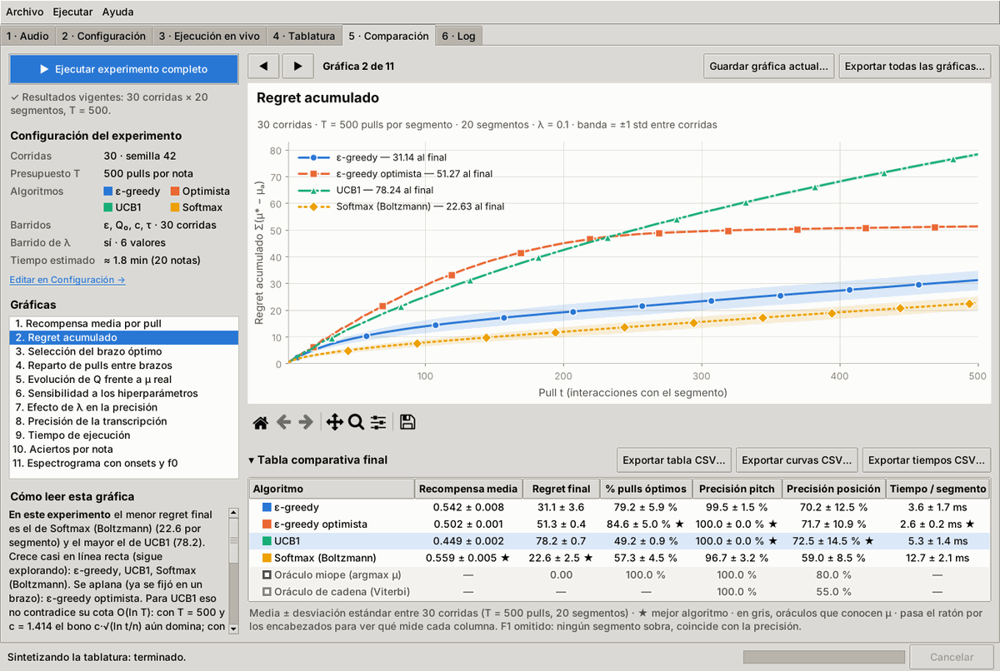

- **Ejecutar experimento completo**: usa Configuración → Experimento (corridas, semilla, barridos) y muestra un resumen con la duración estimada.
- **Gráficas**: lista de las 11 gráficas; las que no tienen datos aparecen en gris. **◀ ▶** para navegar, **Guardar gráfica actual…** y **Exportar todas las gráficas…** (PNG y PDF).
- **Cómo leer esta gráfica**: la teoría y una frase «En este experimento…» calculada con los datos, de modo que el texto nunca contradice a la figura.
- **Tabla comparativa final**: medias ± desviación entre corridas, con ★ en el mejor de cada columna y los oráculos en gris. **Exportar tabla / curvas / tiempos CSV**. Un clic en la fila de un algoritmo lo selecciona en las demás pestañas; un clic en el mapa de aciertos o en el espectrograma selecciona la nota.

La captura muestra un experimento de **30 corridas** lanzado desde la GUI. Las cifras de la sección 7 son de la CLI con las 100 corridas por defecto, así que difieren ligeramente.

### 6.6 Pestaña 6 · Log

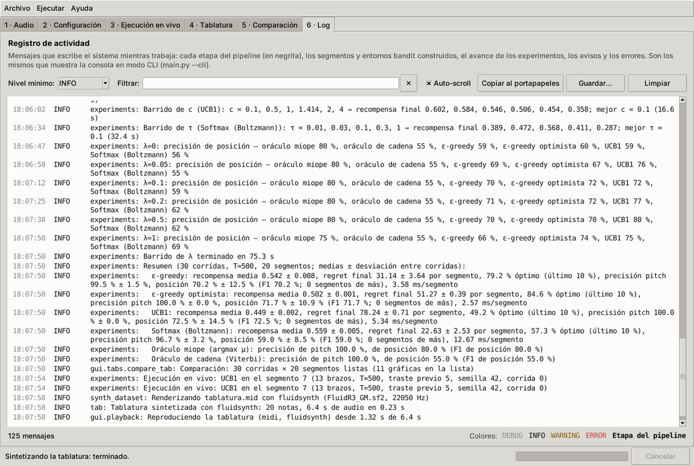

Muestra los mismos mensajes que la consola de la CLI: cada etapa del pipeline (en negrita), los brazos de cada entorno, el avance del experimento, los avisos y los errores.

- **Nivel mínimo** (DEBUG a ERROR) y **Filtrar**: muestra solo las líneas que contienen el texto, sin distinguir mayúsculas, y resalta las coincidencias. Los mensajes se guardan en un búfer, así que cambiar el filtro no pierde nada.
- **Auto-scroll**, **Copiar al portapapeles**, **Guardar…** y **Limpiar**.

Sirve para narrar en clase qué hace el sistema y en qué orden, y para diagnosticar un análisis sin abrir una terminal.

---

## 7. Evaluación

### 7.1 Dataset sintético con ground truth

Una grabación real no dice en qué cuerda se tocó cada nota. Por eso `src/synth_dataset.py` fabrica piezas cuya tablatura se conoce. Cada pieza se escribe a mano como una lista de posiciones (cuerda, traste, duración), tal como la tocaría un bajista, y se genera así:

```text
posiciones (cuerda, traste, duración)
  ├──► <pieza>.gt.json   onset, offset, MIDI, cuerda y traste de cada nota
  └──► notas MIDI ──► <pieza>.mid   (programa GM 33, bajo con dedos)
                          └──► fluidsynth + FluidR3_GM (o Karplus-Strong) ──► mono, normalizado ──► <pieza>.mp3
```

Las tres piezas están a 100 bpm y se sintetizaron con fluidsynth:

| Pieza | Notas | Qué pone a prueba |
|---|---|---|
| `linea_simple` | 16: 15 negras (0.6 s) y una blanca final, I–IV–V en La | Caso fácil de referencia: notas largas, mano en los trastes 0–4 y alternativas lejanas (A-4 = E-9, D-2 = A-7 = E-12) que λ debe descartar. |
| `cromatica` | 21 corcheas (0.3 s), E-0 … G-5 | Todo el registro grave (E1 = 41.2 Hz, con fundamental débil), notas a un semitono y posiciones ambiguas con cuerda al aire (A-0 = E-5, D-0 = A-5, G-0 = D-5). |
| `riff_saltos` | 20 notas: negras, corcheas y semicorcheas (0.15 s) | Notas repetidas (re-ataques del mismo pitch), notas cortas con pocos frames, saltos de cuerda y posiciones fuera de la primera posición (A-5, A-7, D-7…) donde el traste previo importa. |

`src/pipeline.py` carga automáticamente el `<pieza>.gt.json` que está junto al MP3.

### 7.2 Métricas

| Métrica | Definición |
|---|---|
| **Recompensa media** | Media de $r_t$ sobre los T pulls y las notas. |
| **Regret final** | $R_T$ por nota, promediado sobre las notas (sección 2.4). |
| **% óptimo** | Fracción de pulls al brazo argmax μ en el último 10 % del presupuesto (los últimos 50 pulls). |
| **Precisión de pitch / posición** | Fracción de notas del ground truth cuyo segmento recibió el MIDI correcto, o la cuerda y el traste correctos. Es un *recall*. Cada nota real se empareja uno a uno con un segmento a ≤ 80 ms (`experiment.onset_tolerance_s = 0.08`) mediante emparejamiento bipartito máximo, y las notas sin segmento cuentan como error. |
| **F1** | $2\cdot\text{aciertos}/(\text{notas GT} + \text{segmentos})$; también penaliza los segmentos de más. En las tres piezas hay 0 segmentos de más, así que F1 = precisión. |
| **Oráculo miope** | argmax μ en cada nota, dado el traste que dejó **su propia** elección anterior. Equivale a un bandit con T → ∞ y es el techo de **recompensa** (regret 0), **no** de precisión. |
| **Oráculo de cadena (Viterbi)** | Las posiciones que maximizan $\sum_s \mu_s(a_s \mid \text{traste}_{\text{previo},s})$ en toda la pista, por programación dinámica sobre la posición de la mano. Es el óptimo del **modelo**, tampoco de la precisión. |

### 7.3 Tabla comparativa (experimento real)

Comando, con la configuración por defecto (semilla **42**, 100 corridas, T = 500, λ = 0.1, k = 2):

```powershell
python main.py --cli experiment data/synthetic/riff_saltos.mp3 --out <carpeta>
```

Tardó 2 min 22 s de pared, barridos incluidos, en un contenedor Linux de 4 núcleos. Resultados con 20 notas, 20 segmentos, 0 sin detectar y 0 de más; media ± desviación entre corridas:

| Algoritmo | Recompensa media | Regret final | % óptimo (últ. 10 %) | Precisión pitch | Precisión posición | ms / nota |
|---|---|---|---|---|---|---|
| ε-greedy | 0.542 ± 0.008 | 31.78 ± 3.56 | 79.6 ± 6.0 | 99.6 ± 1.5 % | 71.0 ± 11.9 % | 2.48 |
| ε-greedy optimista | 0.503 ± 0.002 | 51.18 ± 0.39 | **86.1 ± 5.5** | **100.0 ± 0.0 %** | 72.9 ± 13.4 % | 2.39 |
| UCB1 | 0.449 ± 0.002 | 78.27 ± 0.63 | 49.6 ± 0.9 | **100.0 ± 0.0 %** | **73.8 ± 13.9 %** | 4.28 |
| Softmax (Boltzmann) | **0.561 ± 0.006** | **21.82 ± 3.00** | 58.2 ± 4.5 | 97.0 ± 3.1 % | 60.8 ± 9.7 % | 5.44 |
| Oráculo miope (argmax μ) | — | 0 | 100 | 100 % | 80.0 % | — |
| Oráculo de cadena (Viterbi) | — | — | — | 100 % | 55.0 % | — |

Las otras dos piezas, con 30 corridas (`--runs 30`, misma semilla 42, mismos valores por defecto):

```powershell
python main.py --cli experiment data/synthetic/linea_simple.mp3 --runs 30 --out <carpeta>
python main.py --cli experiment data/synthetic/cromatica.mp3 --runs 30 --out <carpeta>
```

| Algoritmo | `linea_simple`: pitch / posición | `linea_simple`: regret | `cromatica`: pitch / posición | `cromatica`: regret |
|---|---|---|---|---|
| ε-greedy | 98.8 / 60.6 % | 37.96 | 99.2 / 44.6 % | 35.92 |
| ε-greedy optimista | 100 / 66.2 % | 61.50 | 100 / 25.2 % | 56.34 |
| UCB1 | 100 / 72.3 % | 89.56 | 100 / 23.8 % | 88.97 |
| Softmax | 99.4 / 55.2 % | 21.70 | 98.3 / 56.0 % | 24.75 |
| Oráculo miope | 100 / 87.5 % | 0 | 100 / 23.8 % | 0 |
| Oráculo de cadena | 100 / 87.5 % | — | 100 / 71.4 % | — |

**Lectura rápida.**

- El **pitch** está resuelto: los cuatro algoritmos aciertan 97–100 % y los oráculos el 100 %, así que la recompensa discrimina bien las notas.
- La **posición** es el problema interesante y depende de dos cosas: de lo bien que el algoritmo separa brazos casi empatados (brechas ≈ 0.04) y de que el modelo de tocabilidad coincida con la digitación real.
- Softmax tiene la **mayor recompensa y el menor regret**, pero la **peor precisión de posición** en `riff_saltos`. Optimizar la recompensa no es lo mismo que acertar la cuerda.

### 7.4 Gráficas: cómo leerlas y qué muestran

Todas salen del experimento de `riff_saltos` anterior, salvo que se indique otra cosa. Los colores, marcadores y estilos de línea son fijos por algoritmo, y las bandas son ±1 desviación entre corridas.

#### 7.4.1 Recompensa media por pull

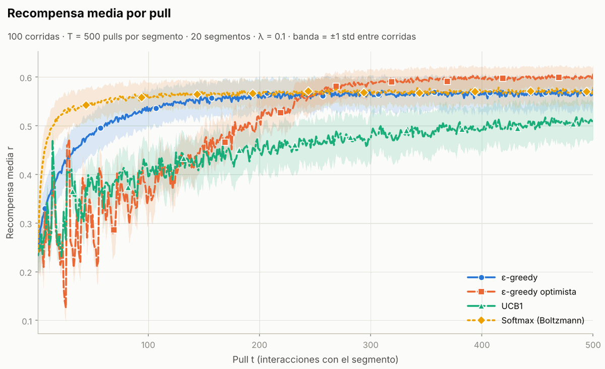

**Cómo leerla.** Es la recompensa del pull t, promediada sobre notas y corridas. Cuanto antes sube y más alto se estabiliza, mejor equilibra el algoritmo exploración y explotación.

**Qué muestra.**

- **Softmax** sube primero: en 50 pulls ya está en 0.54, porque explora sobre todo entre brazos buenos.
- **ε-greedy** sube algo más despacio y se estabiliza en ≈ 0.575.
- **El optimista** empieza muy bajo y con oscilaciones fuertes: recorre todos los brazos mientras su Q baja desde 2. Después supera a todos y termina en **0.606** en el pull 500.
- **UCB1** queda abajo (0.51 al final), por la sobre-exploración que se ve en la siguiente gráfica.

#### 7.4.2 Regret acumulado

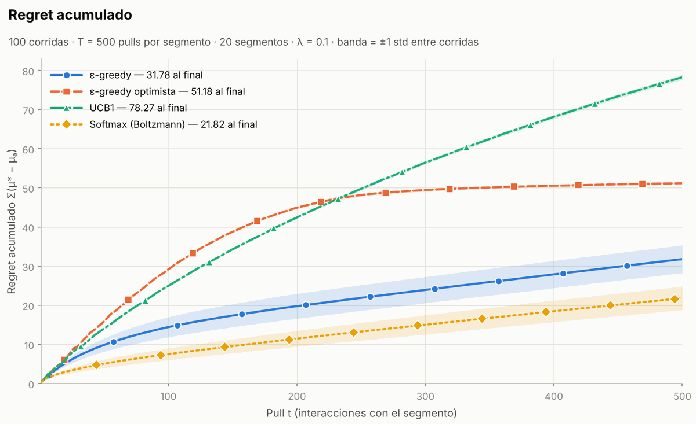

**Cómo leerla.** Una curva que se aplana indica que el agente encontró el mejor brazo; una que crece en línea recta, que sigue explorando a ritmo constante.

**Qué muestra.** Regret acumulado por nota en t = 250 y t = 500, y pendiente media en los últimos 100 pulls:

| Algoritmo | $R_{250}$ | $R_{500}$ | Pendiente final (por pull) | Interpretación |
|---|---|---|---|---|
| Optimista | 48.2 | 51.2 | **0.0065** | Paga casi todo su regret durante la fase optimista y luego **converge**: su curva es la más plana. |
| ε-greedy | 21.9 | 31.8 | 0.039 | Crece casi lineal, por la fracción ε de pulls al azar. |
| Softmax | 13.3 | **21.8** | 0.033 | El menor regret total, pero sigue repartiendo pulls entre posiciones gemelas. |
| **UCB1** | 49.8 | 78.3 | **0.10** | El mayor regret, y **sigue creciendo**. |

Lo de UCB1 no contradice su cota $O(\ln T)$: con brechas de ≈ λ/12 ≈ 0.008 por traste entre posiciones del mismo pitch, el bono $c\sqrt{\ln t/n}$ con c = √2 vale ≈ 0.57 en t = 500 con n ≈ 38 pulls por brazo. Es más de diez veces la brecha entre D-2 y A-7 (0.042), así que el término $\ln T/\Delta$ de la cota es enorme y T = 500 está lejísimos del régimen asintótico (sección 4.4).

#### 7.4.3 Selección del brazo óptimo

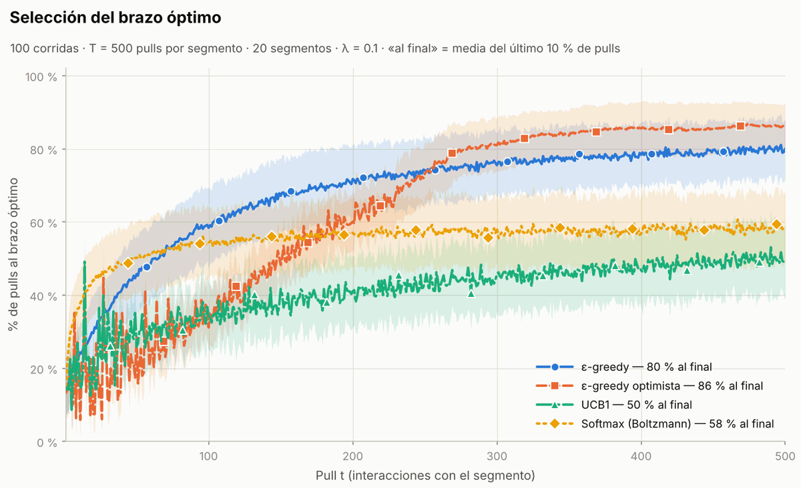

**Cómo leerla.** Es el % de notas en las que el pull t fue al brazo argmax μ. A diferencia de la recompensa, distingue posiciones con el mismo pitch.

**Qué muestra.** Al final:

| Algoritmo | % de pulls al óptimo |
|---|---|
| Optimista | 86 % |
| ε-greedy | 80 % |
| Softmax | 58 % |
| UCB1 | 50 % |

Softmax es el caso didáctico. Entre A-7 y D-2 la diferencia de Q es ≈ 0.04, y con τ = 0.1 eso solo da un factor $e^{0.4} \approx 1.5$ de probabilidad. Reparte los pulls entre las posiciones gemelas, que tienen casi la misma recompensa: por eso logra la mayor recompensa media con solo 58 % de pulls óptimos.

#### 7.4.4 Reparto de pulls entre brazos (segmento ejemplo)

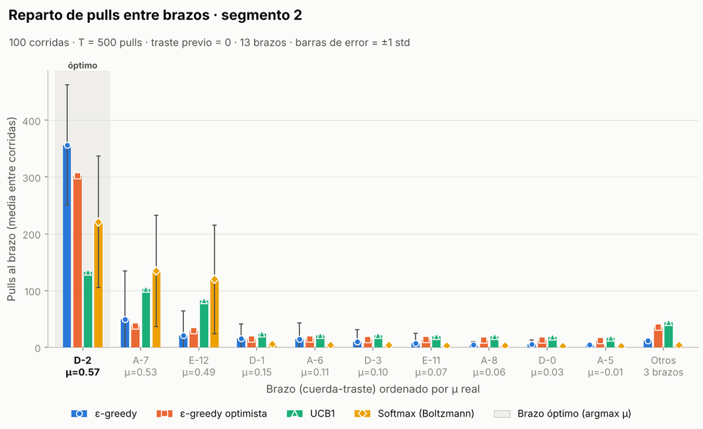

**Cómo leerla.** Muestra cuántos de los 500 pulls dedicó cada algoritmo a cada brazo, con los brazos ordenados por μ. El segmento es el 2 (E2, traste previo 0), con 13 brazos. El óptimo, D-2, tiene fondo gris.

**Qué muestra.**

- ε-greedy y el optimista concentran ≈ 300–350 pulls en D-2.
- Softmax reparte ≈ 220 / 135 / 120 entre las tres posiciones de E2 (D-2, A-7, E-12) y casi nada en los otros pitches.
- UCB1 da ≈ 130 / 100 / 80 a las tres posiciones de E2 y además ≈ 20 a **cada** brazo de otro pitch: explora todo.

Aun así, el brazo **más jalado** de UCB1 es D-2. Con la recomendación «más jalado», UCB1 logra la mejor precisión de posición de los cuatro pese a solo 50 % de pulls óptimos.

#### 7.4.5 Evolución de Q frente a μ real

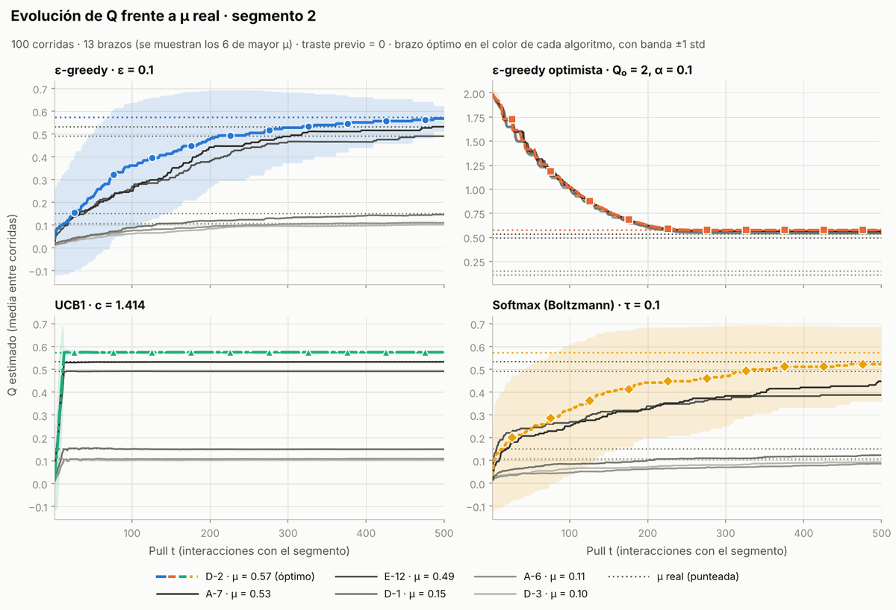

**Cómo leerla.** Hay un panel por algoritmo con la Q media de los 6 brazos de mayor μ (el óptimo en color) y sus μ como líneas punteadas.

**Qué muestra.**

- **UCB1** estima **todas** las Q casi perfectamente desde el principio, porque las prueba todas: aprende, pero no explota lo aprendido.
- **El optimista**: todas las Q bajan juntas desde Q₀ = 2 y, hacia el pull 200, el óptimo se separa por arriba.
- **ε-greedy**: la Q del óptimo converge, y las de los brazos gemelos (A-7, E-12) suben despacio porque se prueban poco.
- **Softmax**: tiene la banda más ancha. En algunas corridas el óptimo se queda con pocas muestras y su Q media queda por debajo de μ.

#### 7.4.6 Sensibilidad a los hiperparámetros

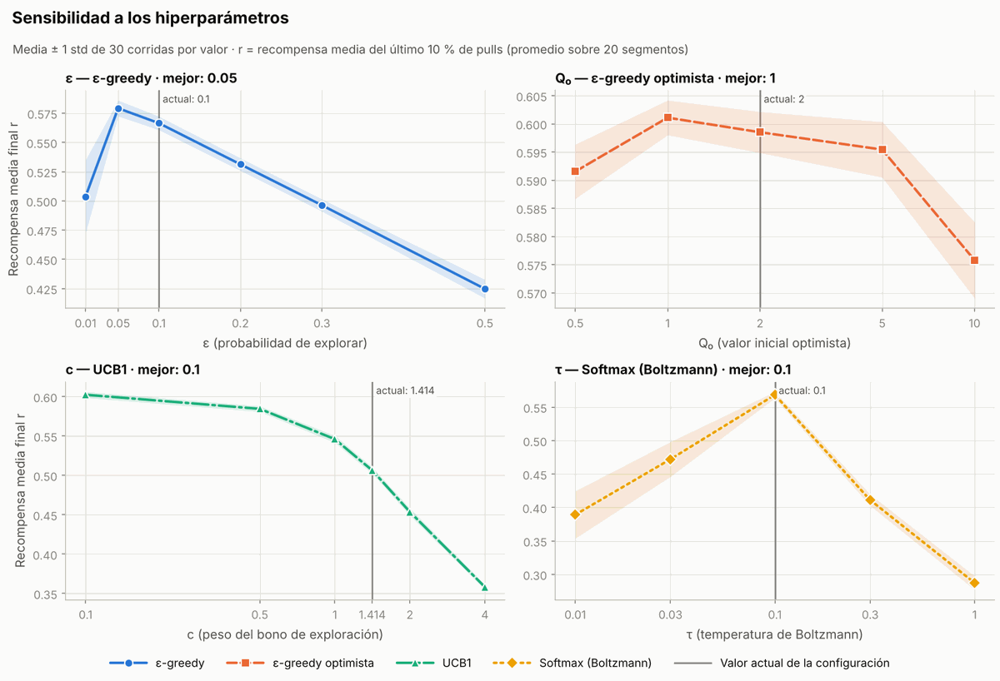

**Cómo leerla.** Es la recompensa media del último 10 % de pulls al variar el hiperparámetro de cada algoritmo, con 30 corridas por valor. La línea gris marca el valor de la configuración. Una U invertida refleja el dilema exploración–explotación.

**Qué muestra.**

| Hiperparámetro | Valores barridos → recompensa final | Lectura |
|---|---|---|
| ε | 0.01 → 0.504 · **0.05 → 0.579** · 0.1 → 0.566 · 0.2 → 0.531 · 0.3 → 0.496 · 0.5 → 0.425 | U invertida clásica: muy poco ε se queda con estimaciones malas; mucho ε desperdicia pulls. |
| Q₀ | 0.5 → 0.592 · **1 → 0.601** · 2 → 0.599 · 5 → 0.595 · 10 → 0.576 | Casi plana: con α = 0.1 el optimismo se olvida rápido; Q₀ = 10 alarga demasiado la fase de exploración. |
| c | **0.1 → 0.602** · 0.5 → 0.584 · 1 → 0.546 · 1.414 → 0.506 · 2 → 0.454 · 4 → 0.358 | Monótona: el c de Hoeffding supone recompensas en [0, 1] con varianza máxima, pero aquí el ruido es ≈ 0.07 y las brechas pequeñas, así que conviene un c mucho menor. |
| τ | 0.01 → 0.389 · 0.03 → 0.472 · **0.1 → 0.568** · 0.3 → 0.411 · 1 → 0.287 | U invertida pronunciada. Con τ = 0.01 Softmax **se fija** en el primer brazo con recompensa positiva ($e^{60}$ frente a 1) y no sale de él; con τ = 1 es casi uniforme. |

Los valores por defecto se dejaron «de libro» (ε = 0.1, Q₀ = 2, c = √2, τ = 0.1) para que la comparación sea la clásica. Este barrido muestra cuánto mejora cada algoritmo al ajustarlo.

#### 7.4.7 Efecto de λ en la precisión

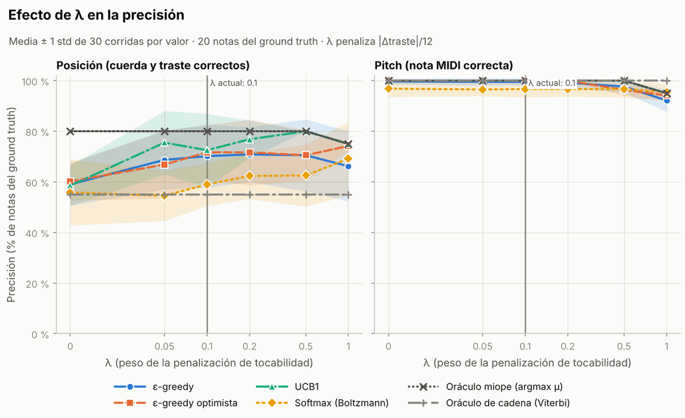

**Cómo leerla.** Es la precisión de posición (izquierda) y de pitch (derecha) frente a λ, con 30 corridas por valor, para los cuatro algoritmos y los dos oráculos.

**Qué muestra en `riff_saltos`.**

- Con **λ = 0**, las posiciones gemelas empatan y los bandits eligen casi al azar entre ellas: 56–60 % de posición.
- Al subir λ, la posición mejora: UCB1 pasa de 59 % a **80 %** con λ = 0.5, igual que el oráculo miope. El pitch apenas cambia hasta λ = 1, donde cae a 92–95 %: la penalización empieza a imponerse a la saliencia.
- El oráculo miope está en 80 % incluso con λ = 0, porque desempata por el menor movimiento de la mano: equivale a λ → 0⁺.

**El signo del efecto depende de la pieza.** En `cromatica` ocurre lo contrario:

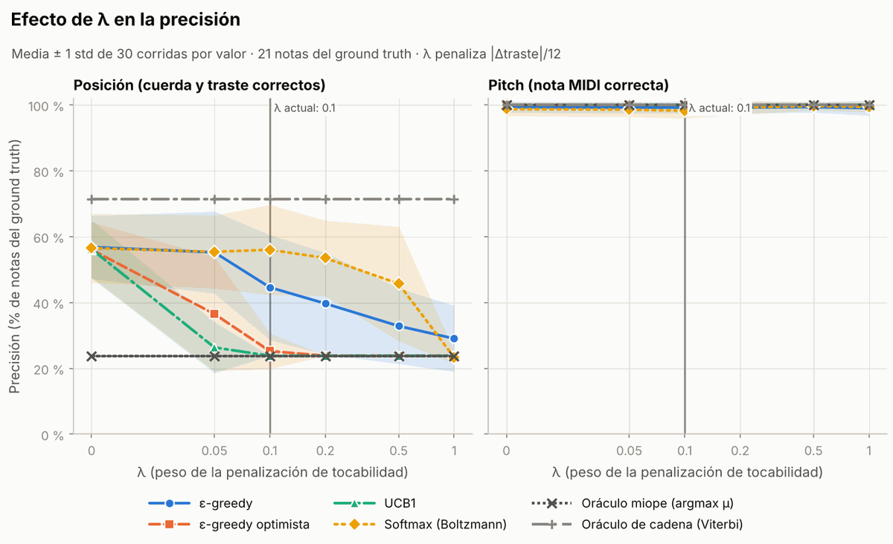

`cromatica` (30 corridas): con λ > 0, los algoritmos que mejor convergen (UCB1 y el optimista) caen al 24 % del oráculo miope. La razón está en el mapa de aciertos de 7.4.10.

#### 7.4.8 Precisión de la transcripción

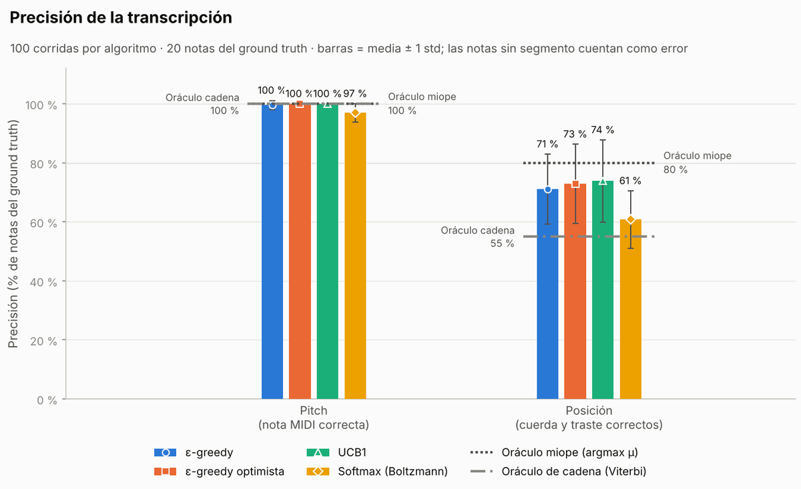

**Cómo leerla.** Barras de precisión de pitch y de posición, media ± 1 desviación. Las líneas de referencia son los dos oráculos.

**Qué muestra.** El pitch está en 97–100 % para todos. En posición, los bandits quedan entre los dos oráculos: el miope (80 %) por arriba y el de cadena (55 %) por abajo.

**La precisión de posición está acotada por el modelo de tocabilidad.** Un bandit perfecto converge a argmax μ, es decir, al oráculo miope. Si la penalización $\lambda\lvert\Delta\text{traste}\rvert/12$ no describe cómo toca el bajista, ni el mejor algoritmo de RL acierta la cuerda: en `cromatica`, UCB1 iguala al oráculo con un 23.8 % ± 0.0. Si un bandit supera al oráculo, como ε-greedy y Softmax en `cromatica`, es porque **se equivoca a favor**: su exploración lo aparta de un modelo que estaba mal.

#### 7.4.9 Tiempo de ejecución

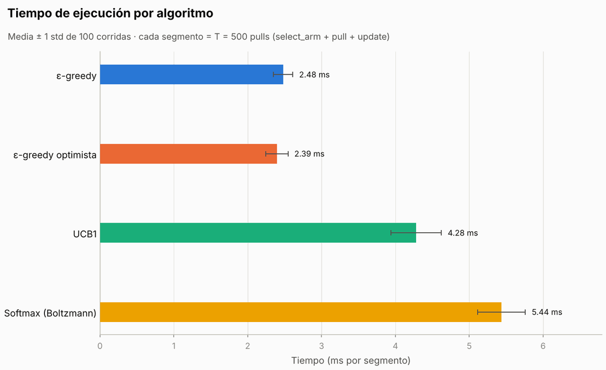

**Cómo leerla.** Milisegundos por nota (500 pulls de `select_arm` + `pull` + `update`).

**Qué muestra.**

| Algoritmo | ms por nota | µs por pull | Qué cuesta decidir |
|---|---|---|---|
| Optimista | 2.39 | ≈ 5 | un argmax |
| ε-greedy | 2.48 | ≈ 5 | un argmax |
| UCB1 | 4.28 | ≈ 9 | un bono por brazo |
| Softmax | 5.44 | ≈ 11 | exponenciar y muestrear |

Todo es despreciable frente a pYIN: el coste del sistema está en el análisis de audio, no en el aprendizaje.

#### 7.4.10 Aciertos por nota

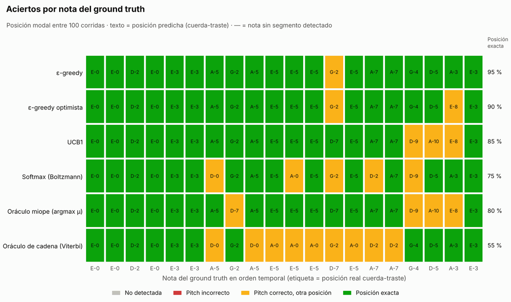

**Cómo leerla.** Hay una columna por nota real, etiquetada con su posición, y una fila por algoritmo. La celda muestra la posición **modal** entre corridas y su color:

| Color | Significado |
|---|---|
| verde | posición exacta |
| ámbar | pitch correcto en otra posición |
| rojo | pitch incorrecto |
| gris | nota no detectada |

Errores comunes a todas las filas apuntarían a la recompensa o a pYIN; aquí no hay ninguno rojo.

**Qué muestra.**

- Votando entre corridas, ε-greedy llega al **95 %** de posición, frente a un 71 % por corrida: sus errores caen en notas distintas en cada corrida.
- El oráculo miope falla la nota G-2 (elige D-7): viene de A-5, y desde el traste 5 D-7 está a 2 trastes y G-2 a 3.
- El oráculo de cadena prefiere quedarse junto a la cejuela, con cuerdas al aire (A-0, D-0) y D-2. Eso suma más μ en el modelo, pero no es la digitación real.

**Miope frente a Viterbi.**

- En `riff_saltos`, el de cadena tiene **mayor** $\sum\mu$ (12.135 frente a 12.101) y **menor** precisión (55 % frente a 80 %).
- En `cromatica` empatan en $\sum\mu$ (13.296) y solo el desempate decide: 71.4 % frente a 23.8 %.
- En `linea_simple` coinciden (87.5 %).

Un óptimo mejor del modelo no implica una tablatura más fiel: el modelo no sabe que la mano cubre 4 trastes sin moverse ni que las cuerdas al aire son «gratis».

En `cromatica` se ve el fallo del modelo de forma muy clara:

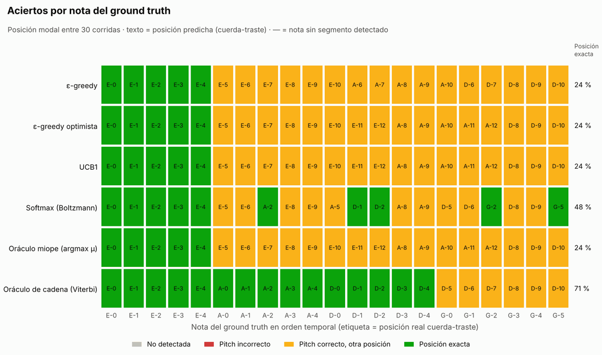

La pieza es una escala en primera posición. Tras E-4, la nota siguiente (A1) cuesta 1 traste en E-5 y 4 en A-0. La cadena miope elige E-5 y **sube por el mástil**: E-6 … E-12, luego A-8 … A-12 y D-8 … D-10. Un bajista real cambia de cuerda y se queda en la primera posición.

#### 7.4.11 Espectrograma con onsets y f0

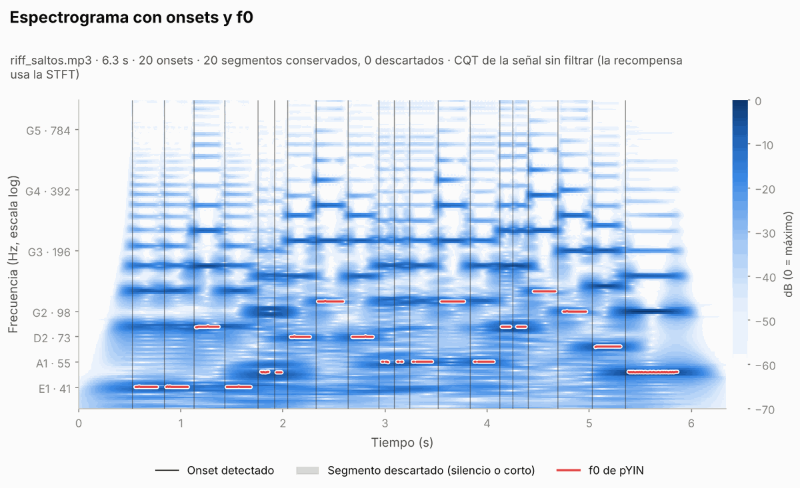

**Cómo leerla.** Es la CQT de la señal sin filtrar (solo para visualizar), con los onsets detectados (líneas) y la f0 de pYIN (rojo).

**Qué muestra.** En `riff_saltos` hay 20 onsets para 20 notas, ninguno descartado, y la f0 de cada nota cae sobre su fundamental. Se ve también el peine de armónicos que mide la recompensa, con la fundamental débil de E1 (41 Hz) frente a sus armónicos.

### 7.5 Discusión

**Dos problemas de dificultad muy distinta.** Elegir el **pitch** es fácil: un brazo de otro pitch está a Δ ≈ 0.4 del óptimo, frente a un ruido entre frames de ≈ 0.07, y cualquier estrategia lo descarta en unas decenas de pulls (≈ 70 para UCB1, sección 4.4). Por eso los cuatro algoritmos aciertan el 97–100 % del pitch. Elegir la **cuerda** es difícil: las posiciones gemelas solo se separan por la penalización de tocabilidad, con brechas de 0.04–0.08, del orden del ruido. Toda la diferencia entre algoritmos está en cómo exploran entre esas gemelas.

**Regret bajo no es lo mismo que buena tablatura.** Minimizar el regret premia explotar pronto: Softmax tiene el menor regret (21.8) porque concentra los pulls en las gemelas, que rinden casi lo mismo, sin decidirse entre ellas. La tablatura, en cambio, solo usa la recomendación final, así que lo que importa es **identificar el mejor brazo**: ahí ganan los que exploran lo suficiente. UCB1 tiene el mayor regret (78.3) y aun así la mejor precisión de posición (73.8 %), y el optimista paga toda su exploración al principio y luego converge (pendiente final 0.0065). Es la diferencia clásica entre minimizar el regret e identificar el mejor brazo (*best-arm identification*).

**Qué algoritmo usar.**

| Objetivo | Mejor opción en este problema | Por qué |
|---|---|---|
| Recompensa acumulada (regret) | Softmax | Exploración graduada por el valor: casi no gasta pulls en otros pitches. |
| Posición final con T = 500 | UCB1, optimista o ε-greedy (71–74 %) | Exploran lo bastante para separar las gemelas. Sus diferencias son menores que la variación entre corridas (±12–14 puntos). |
| Convergencia limpia y barata | Optimista | Exploración dirigida al principio y greedy después: la curva de regret más plana y el menor tiempo por pull. |

**Los valores «de libro» no son los mejores aquí.** El barrido (7.4.6) muestra que c = √2 sobre-explora: con c = 0.1, UCB1 pasa de 0.506 a 0.602 de recompensa final. La cota de Hoeffding supone la varianza máxima de una recompensa en [0, 1], y aquí el ruido es mucho menor. τ y ε también tienen un óptimo interior (τ = 0.1, ε = 0.05): la U invertida del dilema exploración–explotación.

**El techo lo pone el modelo, no el algoritmo.** Un bandit perfecto converge al oráculo miope, que acierta el 80 % de las posiciones en `riff_saltos`, el 87.5 % en `linea_simple` y solo el 23.8 % en `cromatica`. Además, el efecto de λ cambia de signo según la pieza (7.4.7). Para mejorar la tablatura hace falta un mejor modelo de tocabilidad o aprender entre notas (secciones 8 y 9), no un bandit más sofisticado.

**El aprendizaje es barato.** Decidir cuesta 2–5 ms por nota, frente a decenas de segundos de pYIN en una canción entera.

---

## 8. Limitaciones

**Del modelo**

- **La cuerda la decide la penalización de tocabilidad, no el timbre.** La saliencia solo depende del pitch, así que entre A-0 y E-5 decide únicamente $\lambda\lvert\Delta\text{traste}\rvert/12$. El resultado es una tablatura **tocable**, no necesariamente la que tocó el músico. El timbre real de cada cuerda (una cuerda al aire suena más brillante, un traste alto en la E más opaco) no se usa.
- **El modelo de mano es tosco.** Solo cuenta $\lvert\Delta\text{traste}\rvert$ respecto a la nota anterior. Ignora que la mano cubre ≈ 4 trastes sin moverse, el costo de cambiar de cuerda y la preferencia por las cuerdas al aire, salvo con `open_string_free`. Por eso la cadena miope «sube por el mástil» en `cromatica`.
- **Cada nota empieza sin conocimiento previo.** El agente se reinicia en cada segmento, sin transferir nada de las notas ni de las canciones anteriores, aunque la nota se repita. La sección 9 propone cómo evitarlo.
- **Decisión miope.** La cadena elige nota a nota. El oráculo de Viterbi existe solo como referencia y no se usa para transcribir.
- **El bandit es pequeño y su μ es calculable.** Como μ se obtiene exactamente de la matriz de saliencias, el oráculo resuelve cada nota sin explorar. El encuadre bandit tiene sentido si cada pull representa una medición costosa (analizar un frame) y es, ante todo, el banco de pruebas didáctico para comparar estrategias de exploración. La estocasticidad viene solo del muestreo de frames, ≈ 0.07 de desviación.

**Del audio y de las etapas previas**

- **Sin polifonía.** Una f0 por segmento: dobles cuerdas, acordes y notas que se solapan (*let ring*) no se representan.
- **Notas muy cortas.**
  - Se descartan los segmentos de menos de 0.06 s.
  - Las semicorcheas tienen solo 8–11 frames para muestrear.
  - Los re-ataques del mismo pitch muy rápidos (semicorcheas a 140 bpm) son lo más difícil de segmentar: en la validación del desarrollo se perdieron 4 de 230 notas.
  - La ventana de la STFT (0.37 s) mezcla la nota con la siguiente en pasajes rápidos.
- **Latencia de los onsets.** En el audio de fluidsynth, los onsets llegan de media 27 ms después del note-on, con un máximo de 66 ms. Por eso la tolerancia de emparejamiento es de 80 ms. Las marcas de tiempo de la tablatura tienen ese sesgo.
- **La poda depende de pYIN.** Si pYIN se equivoca en más de k = 2 semitonos (por ejemplo, un error de octava), el brazo correcto **ni siquiera es candidato**. Con los 52 brazos en todas las notas (k = None), la precisión de pitch de ε-greedy baja al ≈ 68 % (medido en el desarrollo).
- **Parámetros fijos.**
  - La frecuencia de muestreo es fija (22 050 Hz): todas las ventanas en muestras están calibradas para ella.
  - Solo hay afinación estándar de 4 cuerdas (E A D G): sin 5 cuerdas, drop D ni afinaciones bajas.
  - Los trastes llegan hasta el 12 por defecto (`n_frets`, hasta 24).
- **La separación HPSS es aproximada.** Deja guitarras y teclados graves. Demucs es mucho mejor, pero pesado y lento en CPU.
- **Sin ritmo musical.** La tablatura da tiempos en segundos, no compases ni figuras.

**De la evaluación**

- La precisión solo se mide en **tres piezas sintéticas** (57 notas, bajo limpio de soundfont). No hay una evaluación cuantitativa con grabaciones reales con efectos, distorsión o mala técnica.
- La GUI muestra **una** corrida por algoritmo con la semilla de la configuración. El experimento muestra que la precisión de posición varía mucho entre corridas: ±10–14 puntos.

---

## 9. Extensión propuesta (no implementada): LinUCB contextual

**Motivación.** Hoy cada nota es un bandit nuevo. Pero las notas se parecen entre sí: el brazo cuyo pitch coincide con pYIN suele ser bueno, saltar 7 trastes suele ser malo, cada bajista tiene sus posiciones preferidas… Un **bandit contextual** puede aprender esos patrones y **conservarlos** entre notas y entre canciones, para necesitar muchos menos pulls por nota.

**Contexto.** Para la nota $s$ y el brazo candidato $a$, un vector de características $x_{s,a}\in\mathbb{R}^d$ (con $d \approx 12$):

| Característica | Ejemplo |
|---|---|
| sesgo | 1 |
| distancia al pitch estimado | $\lvert m(a) - m(\hat f_0)\rvert$ en semitonos, e indicador de que sea 0 |
| movimiento de la mano | $\lvert \text{traste}_a - \text{traste}_{\text{previo}}\rvert/12$ |
| altura en el mástil | $\text{traste}_a/12$ |
| cuerda | one-hot E, A, D, G (4 componentes) |
| cuerda al aire | indicador de traste 0 |
| cuerda previa | indicador de cambio de cuerda |
| duración de la nota | en s |
| fracción de frames con voz | según pYIN |

**Algoritmo** (Li, Chu, Langford y Schapire, 2010), con un único vector de parámetros **compartido** por todos los brazos, porque el conjunto de brazos cambia de una nota a otra. Se inicializa $A = I_d$, $b = 0$. En cada pull:

$$
\hat\theta = A^{-1} b,
\qquad
p_{a} = \hat\theta^{\top} x_{s,a} + \alpha\sqrt{x_{s,a}^{\top} A^{-1} x_{s,a}},
\qquad
a_t = \arg\max_a p_a
$$

$$
A \leftarrow A + x_{s,a_t}\, x_{s,a_t}^{\top},
\qquad
b \leftarrow b + r_t\, x_{s,a_t}
$$

El primer término de $p_a$ es la predicción lineal de la recompensa y el segundo, el bono de incertidumbre en la dirección $x$; aquí $\alpha$ es el peso de la exploración, no un tamaño de paso. Es el análogo de UCB1 cuando los brazos comparten información. $A^{-1}$ se actualiza con Sherman–Morrison en $O(d^2)$ por pull.

**Integración con el código actual**

- **Agente.** Una clase `LinUCBAgent(BanditAgent)` en `src/agents.py`, registrada en `make_agent("linucb", ...)` y en `ALGORITHMS`, `ALGO_LABELS`, `ALGO_COLORS` y `PARAM_SPECS` (para α) de `src/config.py`. Sus métodos:
  - `set_context(X)`: recibe la matriz `(K, d)` de la nota actual antes del primer pull.
  - `select_arm()`: calcula $p_a$ para los K brazos y deja en `last_decision` el texto «predicción + bono», para la pestaña en vivo.
  - `update(arm, r)`: actualiza $A$ y $b$ con `X[arm]`, y además `q` y `counts` de la nota para las gráficas.
  - `reset()`: solo reinicia `q`, `counts` y `t` de la nota y **conserva** $A$ y $b$. Por eso `run_segment`, que llama a `reset()` al empezar cada nota, no necesita cambios.
  - `save(path)` / `load(path)`: guardan $A$ y $b$ en `.npz` para llevar lo aprendido de una canción a otra.
- **Entorno.** `SegmentBanditData` (o una función en `src/environment.py`) calcularía las características que no dependen de la mano. `run_chain` añadiría las que sí dependen de ella, con $\lvert\Delta\text{traste}\rvert$ ya conocido al crear el `BanditEnvironment`. Para el indicador de cambio de cuerda, la cadena tendría que pasar también la cuerda previa, no solo el traste.

**Cómo evaluarla**

- Comparar el regret y la precisión con **presupuestos pequeños** (T = 20–50), donde empezar de cero es más caro, entre UCB1 y LinUCB.
- Medir el regret en las primeras notas de una canción nueva con los pesos aprendidos en otras (*transfer*).
- Con ground truth disponible, una recompensa que premie la digitación real permitiría que $\hat\theta$ aprendiera el **estilo** del bajista: quedarse en una posición, preferir cuerdas al aire. Eso atacaría la principal limitación de la sección 8.

---

## 10. Estructura del repositorio

```text
smartuner/
├── main.py                      Punto de entrada: GUI por defecto; --cli {dataset, analyze, experiment}
├── requirements.txt             Dependencias (numpy, scipy, librosa, soundfile, matplotlib, pretty_midi, imageio-ffmpeg, sounddevice, pytest)
├── requirements-optional.txt    Demucs (separación del bajo con PyTorch)
├── pytest.ini                   Configuración de pytest (tests/ + doctests de src/)
├── README.md                    Este documento
├── docs/img/                    Capturas de la GUI y gráficas del experimento de este README
├── data/synthetic/              Dataset: {cromatica, linea_simple, riff_saltos}.{mp3, mid, gt.json}
├── cache/                       Stems de Demucs y audio para reproducir (se regeneran; ignorado por git)
├── results/                     Salidas de la CLI (ignorado por git)
├── src/                         Núcleo (funciona sin GUI)
│   ├── __init__.py              Paquete del núcleo
│   ├── config.py                Fuente única de hiperparámetros (dataclasses, PARAM_SPECS, colores, validación)
│   ├── io_audio.py              Etapa 1: carga de audio con ffmpeg/imageio-ffmpeg/soundfile; escritura WAV/MP3
│   ├── separation.py            Etapa 2: separación del bajo (Demucs en subproceso o HPSS), caché por SHA-1
│   ├── demucs_runner.py         Subproceso que llama a la API de Demucs y escribe el stem de bajo
│   ├── preprocessing.py         Etapa 3: pasa-bajas de fase cero (y_analysis) y normalización (y_spectral)
│   ├── segmentation.py          Etapa 4: spectral flux log-mel, picos, segmentos y descartes
│   ├── pitch.py                 Etapa 5: pYIN por bloques, f0 por segmento, conversiones Hz ↔ MIDI ↔ nombre
│   ├── environment.py           Etapa 6: brazos, poda ±k, espectro, saliencia, penalización y BanditEnvironment
│   ├── agents.py                Etapa 7: ε-greedy, optimista, UCB1 y Softmax desde cero con numpy
│   ├── pipeline.py              Orquesta las etapas 1–6 → AnalysisResult (+ ground truth)
│   ├── experiments.py           Bucle bandit, cadenas, oráculos, emparejamiento con GT, experimento y LiveSession
│   ├── tab.py                   Etapa 8: tablatura ASCII, exportación TXT/JSON/CSV/MIDI, síntesis y mezcla para escuchar
│   ├── synth_dataset.py         Dataset sintético: piezas, MIDI, fluidsynth/Karplus-Strong, ground truth
│   └── plots.py                 Todas las gráficas (matplotlib orientado a objetos) y su catálogo
├── gui/                         Interfaz tkinter (sin lógica del sistema: solo llama a src/)
│   ├── __init__.py              Paquete de la GUI
│   ├── app.py                   Ventana, menú, estado compartido, bus de eventos y acciones en hilos
│   ├── widgets.py               Tooltips, controles de parámetros, figuras embebidas, barra de estado, reproductor
│   ├── workers.py               Tareas en hilos con cola, progreso y cancelación
│   ├── playback.py              Reproductor de la tablatura sintetizada con cursor sincronizado
│   └── tabs/
│       ├── __init__.py          Paquete de las pestañas
│       ├── audio_tab.py         1 · Audio
│       ├── config_tab.py        2 · Configuración
│       ├── live_tab.py          3 · Ejecución en vivo
│       ├── tablature_tab.py     4 · Tablatura (y escucha)
│       ├── compare_tab.py       5 · Comparación
│       └── log_tab.py           6 · Log
└── tests/                       Pruebas (pytest), deterministas y sin red
    ├── __init__.py              Paquete de pruebas
    ├── conftest.py              Añade la raíz del proyecto al sys.path
    ├── test_config.py           Serialización, conversión de tipos y validación de la configuración
    ├── test_io_audio.py         Carga de audio con ffmpeg, imageio-ffmpeg o soundfile
    ├── test_separation.py       Demucs vía runner y HPSS
    ├── test_preprocessing.py    Pasa-bajas de fase cero y normalización
    ├── test_segmentation.py     Onsets y segmentos con señales sintéticas de bajo
    ├── test_pitch.py            pYIN y conversiones Hz ↔ MIDI ↔ nombre
    ├── test_reward.py           Template armónico y saliencia S = max(S⁺ − β·S⁻, 0)
    ├── test_environment.py      Brazos, poda, espectro, datos por segmento y entorno
    ├── test_agents.py           Los cuatro agentes
    ├── test_experiments.py      Bucle bandit, cadenas, oráculos, evaluación y experimento completo
    ├── test_pipeline.py         Orquestación de las etapas 1–6
    ├── test_synth_dataset.py    Piezas, MIDI, Karplus-Strong, fluidsynth y ground truth
    ├── test_tab.py              Emparejamiento, ASCII alineado y exportación
    ├── test_tab_playback.py     MIDI, síntesis alineada y modos de mezcla
    ├── test_plots.py            Gráficas con resultados falsos construidos con numpy
    ├── test_gui_app.py          Ventana principal: tamaño según la pantalla y cancelación
    ├── test_gui_widgets.py      Widgets comunes y workers
    ├── test_gui_audio.py        Pestaña Audio
    ├── test_gui_config.py       Pestaña Configuración
    ├── test_gui_live.py         Pestaña Ejecución en vivo
    ├── test_gui_tablature.py    Pestaña Tablatura
    ├── test_gui_playback.py     Reproductor de la tablatura
    ├── test_gui_compare.py      Pestaña Comparación
    ├── test_gui_log.py          Pestaña Log
    └── test_gui_smoke.py        Prueba de humo: el flujo completo de un estudiante en < 1 min
```

---

## 11. Reproducibilidad

- **Todo el azar sale de semillas explícitas.** Se usa `np.random.Generator` con semillas derivadas de `experiment.seed = 42` mediante listas `[seed, corrida, nota, …]`, sin `np.random.seed` global. Con la misma semilla, configuración y versiones de las bibliotecas, `summary.csv` y `curves.csv` son idénticos entre ejecuciones; solo cambia `timing.csv`, que mide tiempo de pared.
- **Cada experimento guarda su `config.json`.** Se puede repetir con `python main.py --cli experiment <audio> --config <carpeta>/config.json`.
- **Números aleatorios comunes** (sección 5.5): todos los algoritmos ven la misma secuencia de frames en cada corrida.
- **La GUI reproduce la CLI.** La tablatura de cada algoritmo es la corrida 0 con la semilla de la configuración, igual que `analyze`. La pestaña «Ejecución en vivo» reproduce esa corrida pull a pull.
- **Las cifras de este README** salen de las ejecuciones citadas en la sección 7.3 (semilla 42, configuración por defecto) y de un script que lee el `AnalysisResult` de `riff_saltos` para los ejemplos numéricos de las secciones 2.3, 5.3 y 5.4.

**Valores por defecto** (de `src/config.py`):

| Grupo | Parámetros |
|---|---|
| Audio | 22 050 Hz, separación `auto` (solo si se activa), modelo `htdemucs` |
| Preprocesamiento | pasa-bajas 400 Hz, Butterworth de orden 4 |
| Onsets | salto 256 muestras, δ = 0.05, separación 0.07 s, silencio −35 dB, duración mínima 0.06 s |
| pYIN | 35–250 Hz, ventana 2048, 150 oct/s, probabilidad de cambio 0.1, fracción con voz ≥ 0.2 |
| Entorno | trastes 0–12, k = 2, N = 5, β = 0.5, λ = 0.1, T = 500, STFT con n_fft = 8192, tolerancia ±0.33 semitonos, ataque ignorado 0.03 s, mano inicial en el traste 0, cuerdas al aire sin trato especial (`open_string_free = false`), sin ruido extra; CQT opcional con 36 bins/octava desde 32.70 Hz y 6 octavas |
| Agentes | ε = 0.1 (decaimiento 1.0, ε_min = 0.01); optimista Q₀ = 2, α = 0.1, ε = 0; UCB1 c = 1.414; Softmax τ = 0.1 (annealing 1.0, τ_min = 0.01); recomendación «más jalado» |
| Experimento | 100 corridas, semilla 42, barridos con 30 corridas por valor, tolerancia de onset 0.08 s |

Las cifras pueden variar ligeramente con otras versiones de numpy, librosa o del decodificador MP3, porque cambian las saliencias.

---

## 12. Referencias

- Sutton, R. S. y Barto, A. G. (2018). *Reinforcement Learning: An Introduction* (2.ª ed.). MIT Press. Capítulo 2: bandits de K brazos, regla incremental, ε-greedy, valores iniciales optimistas, UCB y selección softmax (§2.3 en la 1.ª ed., 1998).
- Auer, P., Cesa-Bianchi, N. y Fischer, P. (2002). Finite-time analysis of the multiarmed bandit problem. *Machine Learning*, 47(2–3), 235–256.
- Lai, T. L. y Robbins, H. (1985). Asymptotically efficient adaptive allocation rules. *Advances in Applied Mathematics*, 6(1), 4–22.
- Li, L., Chu, W., Langford, J. y Schapire, R. E. (2010). A contextual-bandit approach to personalized news article recommendation. *Proc. WWW 2010*, 661–670.
- Mauch, M. y Dixon, S. (2014). pYIN: A fundamental frequency estimator using probabilistic threshold distributions. *Proc. IEEE ICASSP 2014*, 659–663.
- de Cheveigné, A. y Kawahara, H. (2002). YIN, a fundamental frequency estimator for speech and music. *JASA*, 111(4), 1917–1930.
- Klapuri, A. (2006). Multiple fundamental frequency estimation by summing harmonic amplitudes. *Proc. ISMIR 2006*.
- Défossez, A., Usunier, N., Bottou, L. y Bach, F. (2019). Music source separation in the waveform domain. arXiv:1911.13254.
- Rouard, S., Massa, F. y Défossez, A. (2023). Hybrid Transformers for music source separation (`htdemucs`). *Proc. IEEE ICASSP 2023*.
- Fitzgerald, D. (2010). Harmonic/percussive separation using median filtering. *Proc. DAFx-10*.
- McFee, B. et al. (2015). librosa: Audio and music signal analysis in Python. *Proc. 14th Python in Science Conference*, 18–25.
- Karplus, K. y Strong, A. (1983). Digital synthesis of plucked-string and drum timbres. *Computer Music Journal*, 7(2), 43–55.
